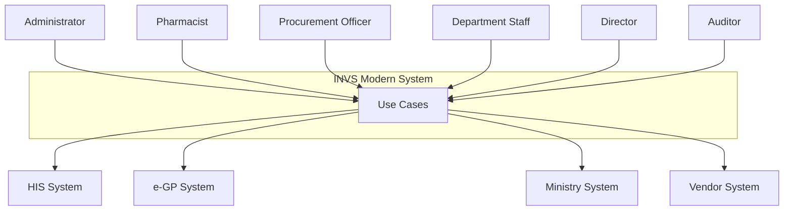
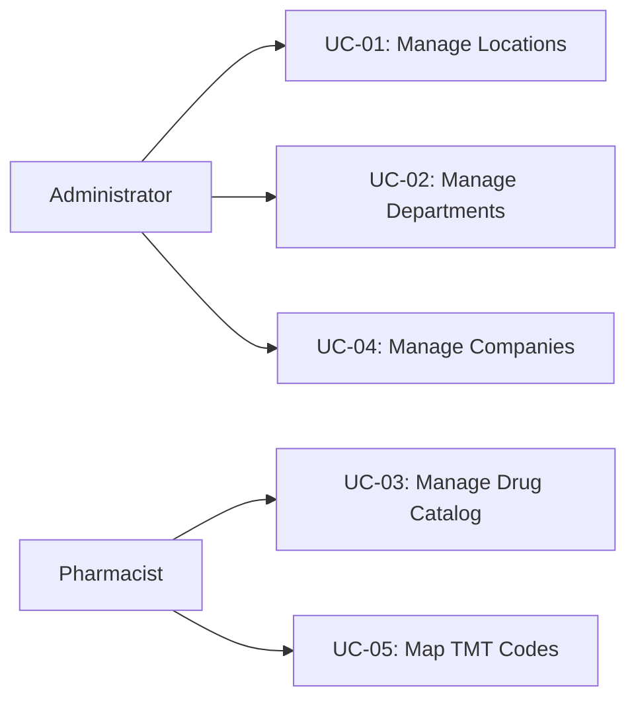
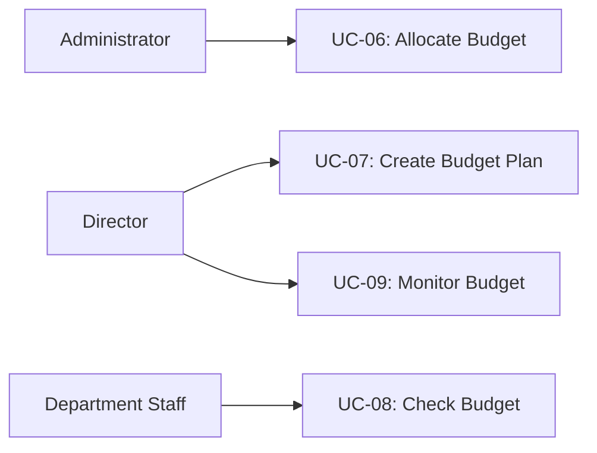
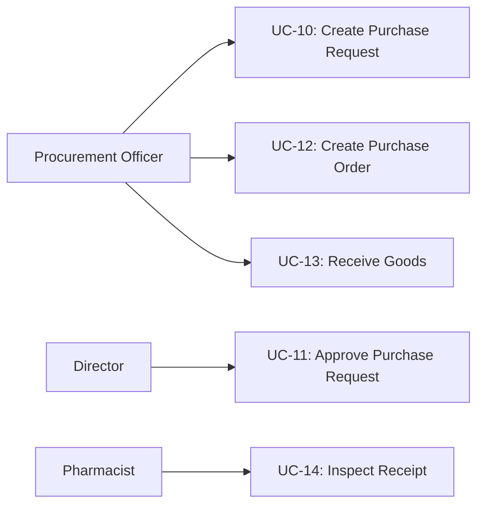
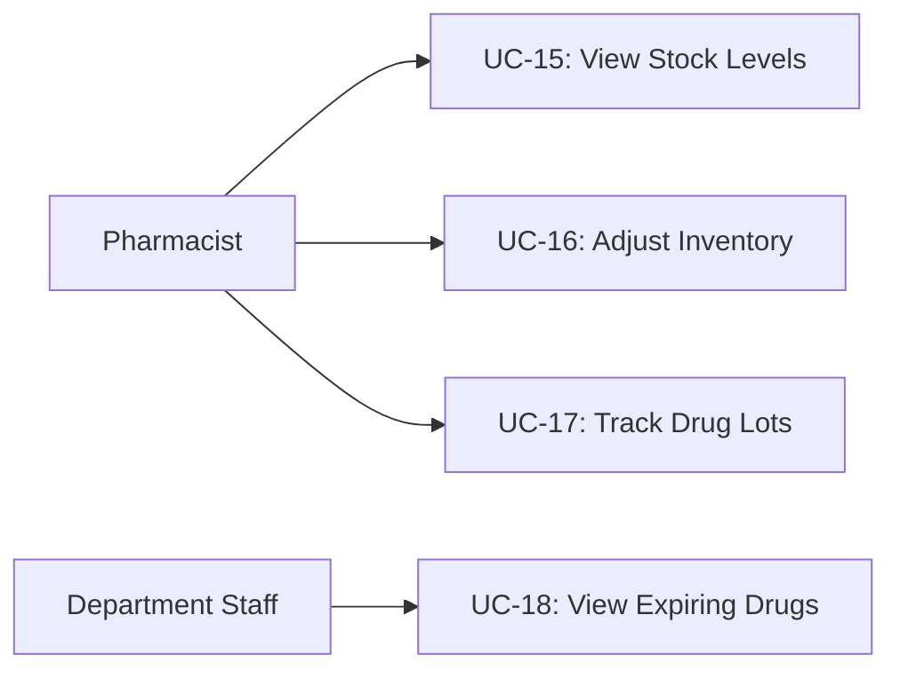
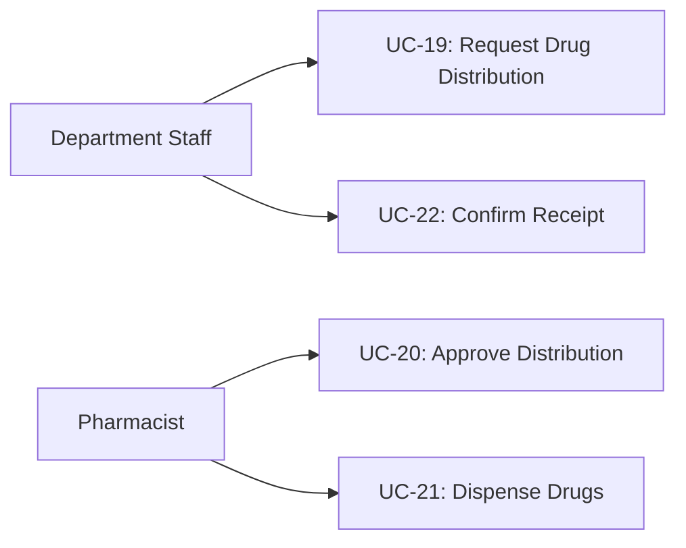
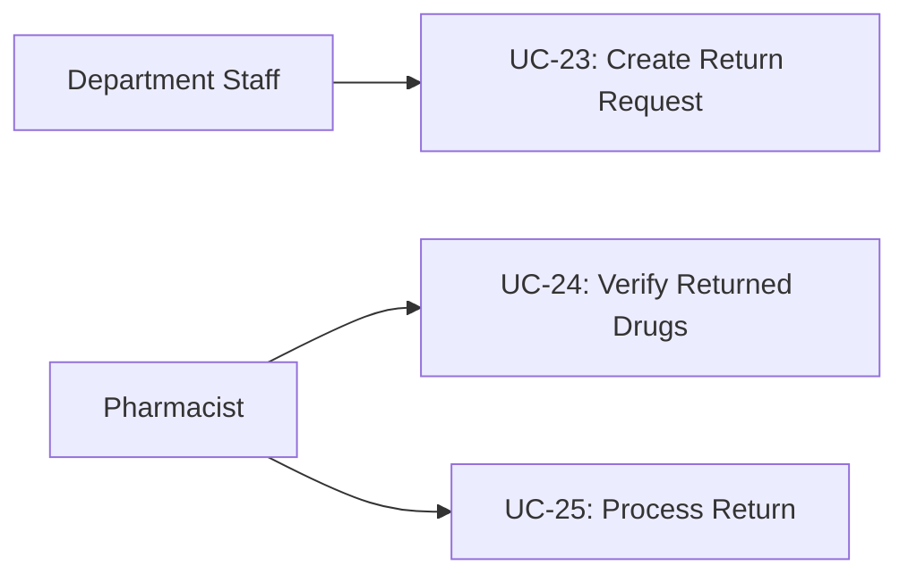
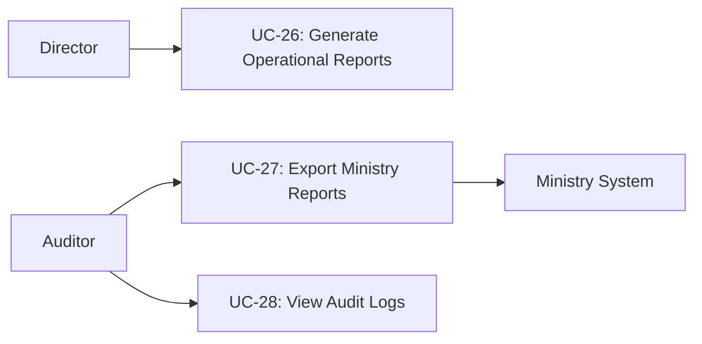

# 📋 Use Case Document

**Project:** INVS Modern - Hospital Inventory Management System
**Version:** 2.4.0
**Date:** 2025-01-22
**Status:** Production Ready (Database Phase)

---

## 📋 Table of Contents

1. [Overview](#1-overview)
2. [Actors](#2-actors)
3. [Use Case Diagram](#3-use-case-diagram)
4. [Use Case Specifications](#4-use-case-specifications)
5. [Use Case Matrix](#5-use-case-matrix)

---

## 1. Overview

### 1.1 Purpose

This document describes all use cases for the INVS Modern hospital inventory management system. Each use case represents a functional requirement from the user's perspective.

### 1.2 Scope

**8 Major Systems:**

1. Master Data Management
2. Budget Management
3. Procurement Management
4. Inventory Management
5. Drug Distribution
6. Drug Return
7. TMT Integration
8. Hospital Pharmaceutical Preparation (HPP)

**Total Use Cases:** 28 core use cases

---

## 2. Actors

### 2.1 Primary Actors

| Actor                   | Role              | Responsibilities                                         |
| ----------------------- | ----------------- | -------------------------------------------------------- |
| **Administrator**       | System Admin      | System configuration, user management, master data setup |
| **Pharmacist**          | Pharmacy Staff    | Drug catalog management, dispensing, inventory control   |
| **Procurement Officer** | Procurement Dept  | Purchase requests, purchase orders, vendor management    |
| **Department Staff**    | Clinical Dept     | Request drugs, return unused drugs, view stock           |
| **Director**            | Hospital Director | Approve purchase requests, budget oversight, reports     |
| **Auditor**             | Audit Team        | View audit logs, compliance reports, financial tracking  |

### 2.2 Secondary Actors

| Actor                                 | Role                   | System                                   |
| ------------------------------------- | ---------------------- | ---------------------------------------- |
| **HIS (Hospital Information System)** | External System        | Provides patient data, prescriptions     |
| **e-GP System**                       | Government Procurement | Receives PO for procurement >500K THB    |
| **Ministry Reporting System**         | MOPH                   | Receives 5 compliance reports            |
| **Vendor System**                     | Supplier               | Receives purchase orders, sends invoices |

---

## 3. Use Case Diagram

### 3.1 System Context Diagram

### 3.2 Master Data Use Cases

### 3.3 Budget Management Use Cases

### 3.4 Procurement Use Cases

### 3.5 Inventory Use Cases

### 3.6 Distribution Use Cases

### 3.7 Return Use Cases

### 3.8 Reporting Use Cases

---

## 4. Use Case Specifications

### 4.1 Master Data Management

---

#### UC-01: Manage Locations

**Primary Actor:** Administrator

**Goal:** Set up and maintain storage locations in the hospital

**Preconditions:**

- User logged in as Administrator
- System is operational

**Basic Flow:**

1. Administrator selects "Manage Locations"
2. System displays list of existing locations
3. Administrator clicks "Add Location"
4. System displays location form
5. Administrator enters:
   - Location code (e.g., "WH-001")
   - Location name (Thai & English)
   - Location type (WAREHOUSE, PHARMACY, WARD, EMERGENCY)
   - Parent location (optional for hierarchy)
   - Capacity information
6. Administrator clicks "Save"
7. System validates data
8. System creates location record
9. System displays success message

**Alternative Flows:**

- **3a. Edit Location**: Administrator selects existing location → modifies data → saves
- **3b. Deactivate Location**: Administrator marks location as inactive
- **7a. Validation Error**: System displays error message, returns to step 5

**Postconditions:**

- New location is available for inventory tracking
- Location appears in location lists throughout system

**Business Rules:**

- Location code must be unique
- Cannot delete location with existing inventory
- Deactivation only allowed if no active stock

---

#### UC-02: Manage Departments

**Primary Actor:** Administrator

**Goal:** Set up and maintain hospital departments

**Preconditions:**

- User logged in as Administrator

**Basic Flow:**

1. Administrator selects "Manage Departments"
2. System displays department list with hierarchy
3. Administrator clicks "Add Department"
4. System displays department form
5. Administrator enters:
   - Department code (e.g., "DEPT-001")
   - Department name (Thai & English)
   - Budget code
   - Parent department (for hierarchy)
   - Consumption group (1-9: OPD, IPD, Emergency, etc.)
6. Administrator saves
7. System validates and creates department
8. System displays success message

**Alternative Flows:**

- **3a. Edit Department**: Modify existing department
- **3b. Deactivate Department**: Mark department inactive

**Postconditions:**

- Department available for distribution requests
- Department appears in budget allocation options

**Business Rules:**

- Department code must be unique
- Cannot delete department with budget allocations
- Consumption group required for ministry reporting

---

#### UC-03: Manage Drug Catalog

**Primary Actor:** Pharmacist

**Goal:** Add, update, and maintain drug catalog (generics and trade drugs)

**Preconditions:**

- User logged in as Pharmacist
- Generic drugs and companies exist in system

**Basic Flow:**

1. Pharmacist selects "Drug Catalog"
2. System displays search interface
3. Pharmacist clicks "Add New Drug"
4. System displays drug form with two sections:
   - Generic drug information
   - Trade drug information
5. Pharmacist enters generic drug data:
   - Working code (WORKING_CODE from ministry)
   - Generic name (Thai & English)
   - Strength (e.g., "500mg")
   - Dosage form
   - Usage type
6. Pharmacist enters trade drug data:
   - Trade code (manufacturer's code)
   - Trade name (brand name)
   - Manufacturer/company
   - Unit price
   - TMT code
   - NLEM status (Essential/Non-essential)
   - Drug status (Active/Inactive/Discontinued/Out of stock)
   - Product category (Drug/Supply/Equipment/Chemical/Other)
7. Pharmacist saves
8. System validates data
9. System creates both generic and trade drug records
10. System displays success message with drug ID

**Alternative Flows:**

- **3a. Add Trade Drug to Existing Generic**: Select generic → add trade drug only
- **3b. Edit Drug**: Search drug → edit → save
- **3c. Deactivate Drug**: Mark drug as inactive
- **8a. Validation Error**: Display error, return to form
- **8b. Duplicate Check**: Warn if similar drug exists

**Postconditions:**

- Drug available for purchase requests
- Drug appears in autocomplete searches
- Drug included in ministry exports

**Business Rules:**

- Working code must match ministry drug list
- TMT code mapping required (target ≥95%)
- One generic can have multiple trade drugs
- Cannot delete drug with inventory or transactions
- Price changes tracked with effective dates

---

#### UC-04: Manage Companies

**Primary Actor:** Administrator

**Goal:** Maintain vendor and manufacturer directory

**Preconditions:**

- User logged in as Administrator

**Basic Flow:**

1. Administrator selects "Companies"
2. System displays company list
3. Administrator clicks "Add Company"
4. System displays company form
5. Administrator enters:
   - Company name (Thai & English)
   - Tax ID
   - Address
   - Contact person
   - Phone, email
   - Company type (MANUFACTURER, VENDOR, BOTH)
   - Bank details (optional)
6. Administrator saves
7. System validates and creates company record
8. System displays success message

**Alternative Flows:**

- **3a. Edit Company**: Modify existing company
- **3b. Deactivate Company**: Mark company inactive

**Postconditions:**

- Company available for purchase orders
- Company appears in vendor selection lists

**Business Rules:**

- Tax ID must be valid format (13 digits)
- Cannot delete company with purchase orders
- Inactive companies hidden from selection

---

#### UC-05: Map TMT Codes

**Primary Actor:** Pharmacist

**Goal:** Map drugs to Thai Medical Terminology (TMT) concepts

**Preconditions:**

- User logged in as Pharmacist
- Drug exists in catalog
- TMT concepts loaded (25,991 concepts)

**Basic Flow:**

1. Pharmacist selects "TMT Mapping"
2. System displays unmapped drugs (target: <5%)
3. Pharmacist selects drug
4. System displays drug details and TMT search
5. Pharmacist searches TMT concepts by:
   - Drug name
   - Generic name
   - Active ingredient
6. System displays matching TMT concepts
7. Pharmacist selects TMT concept
8. System displays mapping form
9. Pharmacist confirms:
   - Mapping type (EXACT, APPROXIMATE, PARENT, CHILD)
   - Confidence score (0.0-1.0)
10. Pharmacist saves mapping
11. System creates TMT mapping record
12. System displays success message

**Alternative Flows:**

- **6a. No Match Found**: Pharmacist can request new TMT code from ministry
- **7a. Multiple Matches**: Pharmacist selects best match with notes

**Postconditions:**

- Drug TMT mapping updated
- Mapping included in ministry exports
- Mapping available for HIS integration

**Business Rules:**

- Target: ≥95% drugs mapped to TMT
- One drug can have multiple TMT mappings
- EXACT mapping preferred, APPROXIMATE allowed with justification
- Confidence score ≥0.8 recommended

---

### 4.2 Budget Management

---

#### UC-06: Allocate Budget

**Primary Actor:** Administrator

**Goal:** Allocate annual budget by department and budget type

**Preconditions:**

- User logged in as Administrator
- Fiscal year and departments exist

**Basic Flow:**

1. Administrator selects "Budget Allocation"
2. System displays fiscal year selection
3. Administrator selects fiscal year (e.g., 2025)
4. System displays allocation form
5. Administrator enters:
   - Department
   - Budget type (6 types: OP001-drugs, OP002-equipment, etc.)
   - Total allocated amount
   - Quarterly breakdown (Q1, Q2, Q3, Q4)
6. System validates: Q1+Q2+Q3+Q4 = Total
7. Administrator saves
8. System creates budget allocation record
9. System displays success message

**Alternative Flows:**

- **3a. Copy from Previous Year**: Copy last year's allocation → adjust amounts
- **6a. Validation Error**: Display error, return to form

**Postconditions:**

- Budget available for purchase requests
- Budget appears in budget status reports

**Business Rules:**

- One allocation per fiscal year + department + budget type
- Quarterly amounts must sum to total
- Cannot modify allocation if budget committed
- Budget revisions require CFO approval (>500K THB)

---

#### UC-07: Create Budget Plan

**Primary Actor:** Director, Pharmacist

**Goal:** Plan drug purchases at generic drug level with historical data

**Preconditions:**

- User logged in as Director or Pharmacist
- Budget allocation exists
- Drug generics exist

**Basic Flow:**

1. User selects "Budget Planning"
2. System displays planning form
3. User enters:
   - Fiscal year
   - Department
   - Budget type (typically OP001-drugs)
   - Plan name (e.g., "Annual Drug Purchase Plan 2025")
4. User clicks "Add Drugs"
5. System displays drug selection with:
   - Drug generic list
   - 3-year historical consumption data
   - Suggested quantities (based on average)
6. User selects drugs and enters:
   - Planned quantity (annual)
   - Planned unit price
   - Quarterly breakdown (Q1-Q4)
   - Justification
7. User reviews total planned budget
8. User saves plan
9. System validates total ≤ allocated budget
10. System creates budget plan and items
11. System displays success message

**Alternative Flows:**

- **5a. Import from Last Year**: Copy previous year plan → adjust quantities
- **9a. Budget Exceeded**: Display warning, allow save as DRAFT

**Postconditions:**

- Budget plan available for PR validation
- Planned vs actual tracking enabled

**Business Rules:**

- Plan total cannot exceed budget allocation
- Quarterly quantities should align with consumption pattern
- Historical data shows 3-year trend
- Variance >20% from plan triggers warning

---

#### UC-08: Check Budget Availability

**Primary Actor:** Procurement Officer, Department Staff

**Goal:** Check if sufficient budget available before creating PR

**Preconditions:**

- User logged in
- Budget allocation exists

**Basic Flow:**

1. User creating purchase request
2. User selects:
   - Fiscal year
   - Department
   - Budget type
   - Quarter
3. User enters requested amount
4. System calls `check_budget_availability()` function
5. System calculates:
   - Allocated amount (for quarter)
   - Reserved amount (active reservations)
   - Spent amount (committed budget)
   - Available = Allocated - Reserved - Spent
6. System displays result:
   - ✅ Available: Show available amount
   - ❌ Insufficient: Show shortfall
7. User proceeds or cancels

**Alternative Flows:**

- **6a. Budget Insufficient**: Display error, cannot proceed
- **6b. Emergency Override**: Director can approve with justification

**Postconditions:**

- User informed of budget status
- Cannot create PR if budget insufficient

**Business Rules:**

- Real-time budget check mandatory
- Cannot bypass budget check (except Director override)
- Budget checked at PR submission and PO approval

---

#### UC-09: Monitor Budget Status

**Primary Actor:** Director, Auditor

**Goal:** Monitor budget utilization across departments

**Preconditions:**

- User logged in as Director or Auditor

**Basic Flow:**

1. User selects "Budget Dashboard"
2. System displays budget status view
3. User filters by:
   - Fiscal year
   - Department (optional)
   - Budget type (optional)
4. System displays for each allocation:
   - Allocated amount
   - Reserved amount (pending PRs)
   - Spent amount (approved POs)
   - Available amount
   - Utilization percentage
   - Status indicators (80%, 90%, 95% thresholds)
5. User can:
   - View details
   - Export to Excel
   - View spending trends (chart)
6. System sends alerts for budget thresholds

**Alternative Flows:**

- **3a. View by Quarter**: Filter by specific quarter
- **5a. Drill Down**: Click allocation → view all PRs and POs

**Postconditions:**

- User has current budget visibility
- Alerts sent if thresholds crossed

**Business Rules:**

- Dashboard updates in real-time (<5 seconds)
- Alerts sent when utilization >80%, >90%, >95%
- Historical data retained for 10 years

---

### 4.3 Procurement Management

---

#### UC-10: Create Purchase Request (PR)

**Primary Actor:** Procurement Officer

**Goal:** Create purchase request for drugs with budget validation

**Preconditions:**

- User logged in as Procurement Officer
- Drugs exist in catalog
- Budget allocation exists

**Basic Flow:**

1. User selects "Create Purchase Request"
2. System displays PR form
3. User enters header:
   - Department
   - Budget type
   - Fiscal year and quarter
   - Justification
4. User clicks "Add Items"
5. System displays drug search
6. User searches and selects drugs
7. For each drug, user enters:
   - Quantity
   - Estimated unit price
8. System calculates total amount
9. User clicks "Check Budget"
10. System calls `check_budget_availability()`
11. System displays budget status
12. If budget available, user clicks "Submit"
13. System validates against budget plan (if exists)
14. System generates PR number (PR-YYYY-NNNN)
15. System changes status: DRAFT → SUBMITTED → BUDGET_CHECK
16. System calls `reserve_budget()` function
17. System changes status: BUDGET_CHECK → BUDGET_RESERVED
18. System sends notification to approver
19. System displays success message

**Alternative Flows:**

- **11a. Budget Insufficient**: Display error, cannot submit
- **13a. Not in Budget Plan**: Display warning, allow continue with justification
- **16a. Reservation Failed**: Rollback, display error

**Postconditions:**

- PR created with status BUDGET_RESERVED
- Budget reserved for 30 days
- Notification sent to Director for approval
- PR number generated and traceable

**Business Rules:**

- Budget check mandatory before submission
- Budget reserved immediately after check passes
- Reservation expires in 30 days if not approved
- PR items must exist in drug catalog
- Minimum 1 item, maximum 100 items per PR

---

#### UC-11: Approve Purchase Request

**Primary Actor:** Director

**Goal:** Review and approve purchase requests

**Preconditions:**

- User logged in as Director
- PR exists with status BUDGET_RESERVED

**Basic Flow:**

1. Director selects "Pending PRs"
2. System displays list of PRs awaiting approval
3. Director selects PR
4. System displays PR details:
   - Items and quantities
   - Total amount
   - Budget status (current)
   - Justification
   - Budget plan comparison (if exists)
5. Director reviews details
6. Director clicks "Approve"
7. System re-checks budget availability
8. System calls `commit_budget()` function
9. System changes status: BUDGET_RESERVED → APPROVED
10. System auto-creates PO from PR
11. System changes PR status: APPROVED → PO_CREATED
12. System sends notification to Procurement
13. System displays success message

**Alternative Flows:**

- **6a. Reject PR**:
  - Director clicks "Reject"
  - Director enters rejection reason
  - System releases budget reservation
  - System changes status to REJECTED
  - System sends notification to requester
- **7a. Budget Changed**: Display warning, require re-approval or rejection

**Postconditions:**

- PR approved and closed
- Budget committed (moved from reserved to spent)
- PO auto-created with status DRAFT
- Notifications sent

**Business Rules:**

- Director approval required for all PRs
- Budget re-checked before approval
- Cannot approve if budget insufficient
- Budget commitment is permanent (cannot undo)
- Auto-PO creation happens immediately

---

#### UC-12: Create Purchase Order (PO)

**Primary Actor:** Procurement Officer

**Goal:** Review and finalize auto-created PO, send to vendor

**Preconditions:**

- User logged in as Procurement Officer
- PO auto-created from approved PR (status: DRAFT)

**Basic Flow:**

1. User selects "Pending POs"
2. System displays POs with status DRAFT
3. User selects PO
4. System displays PO details:
   - Items from PR
   - Vendor (auto-selected or user selects)
   - Purchase method (based on amount)
   - Purchase type
5. User reviews and modifies:
   - Vendor selection
   - Purchase method (18 methods)
   - Purchase type (20 types)
   - Expected delivery date
   - Terms and conditions
6. User clicks "Finalize"
7. System validates:
   - Vendor is active
   - Purchase method matches amount
   - All required fields filled
8. System changes status: DRAFT → PENDING_APPROVAL
9. System sends for approval (if required)
10. After approval, status changes to APPROVED
11. User clicks "Send to Vendor"
12. System generates PO PDF
13. System sends email to vendor with PDF
14. System changes status: APPROVED → SENT
15. System displays success message

**Alternative Flows:**

- **5a. Change Vendor**: Select different vendor, adjust prices
- **5b. Split PO**: Split items to multiple vendors
- **9a. No Approval Required**: PO <100K → skip approval → APPROVED directly

**Postconditions:**

- PO sent to vendor
- Expected delivery date tracked
- PO tracked in procurement pipeline

**Business Rules:**

- Purchase method based on amount:
  - <100K: Direct purchase
  - 100K-500K: Price comparison (3 vendors)
  - > 500K: Public tender (e-GP system)
- PO number format: PO-YYYY-NNNN
- Budget already committed (cannot cancel without director approval)

---

#### UC-13: Receive Goods

**Primary Actor:** Procurement Officer

**Goal:** Record goods received from vendor

**Preconditions:**

- User logged in as Procurement Officer
- PO exists with status SENT
- Vendor delivered goods

**Basic Flow:**

1. User selects "Receive Goods"
2. System displays POs waiting for receipt
3. User selects PO
4. System displays PO items with:
   - Ordered quantity
   - Already received quantity
   - Outstanding quantity
5. User creates receipt
6. For each item received, user enters:
   - Received quantity (can be partial)
   - Lot number
   - Expiry date
   - Manufacture date (optional)
7. User attaches invoice
8. User clicks "Save as Draft"
9. System generates receipt number (RC-YYYY-NNNN)
10. System creates receipt with status DRAFT
11. User clicks "Submit for Inspection"
12. System validates all items have lot/expiry
13. System changes status: DRAFT → INSPECTING
14. System assigns to inspection committee
15. System sends notification
16. System displays success message

**Alternative Flows:**

- **6a. Partial Receipt**: Received quantity < ordered quantity
  - PO status → PARTIAL_RECEIVED
  - Outstanding quantity tracked
- **6b. Over Receipt**: Received > ordered (with tolerance ±10%)
  - Requires approval for excess
- **12a. Validation Error**: Missing lot/expiry → cannot submit

**Postconditions:**

- Receipt created and pending inspection
- PO status updated (PARTIAL_RECEIVED or FULLY_RECEIVED)
- Notification sent to inspection committee
- Lot and expiry data captured

**Business Rules:**

- Receipt requires committee inspection (PO >50K THB)
- Lot number and expiry date mandatory
- Partial receipts allowed (±10% tolerance)
- Over-receipt requires amendment approval

---

#### UC-14: Inspect Receipt

**Primary Actor:** Pharmacist (Inspection Committee)

**Goal:** Inspect received goods for quality and accuracy

**Preconditions:**

- User logged in as Pharmacist
- Receipt exists with status INSPECTING
- User is assigned to inspection committee

**Basic Flow:**

1. Pharmacist selects "Pending Inspections"
2. System displays receipts awaiting inspection
3. Pharmacist selects receipt
4. System displays receipt details and items
5. Pharmacist physically inspects:
   - Quantities match
   - Lot numbers match
   - Expiry dates acceptable
   - Packaging intact
   - Product appearance normal
6. Pharmacist enters inspection result for each item:
   - PASS, FAIL, or CONDITIONAL
   - Inspection notes
7. Pharmacist clicks "Approve Receipt"
8. System validates all items inspected
9. System changes status: INSPECTING → APPROVED
10. System calls `update_inventory_from_receipt()` function
11. System:
    - Creates drug_lots records
    - Updates inventory.quantity_on_hand
    - Creates RECEIVE transactions
    - Updates PO received quantities
12. System changes receipt status: APPROVED → POSTED
13. System displays success message with inventory summary

**Alternative Flows:**

- **7a. Reject Receipt**:
  - Pharmacist clicks "Reject"
  - Pharmacist enters rejection reason
  - System changes status to REJECTED
  - System contacts vendor for return/replacement
  - Inventory NOT updated
- **11a. Posting Failed**: Rollback, display error, keep status APPROVED

**Postconditions:**

- Receipt posted to inventory
- Drug lots created with FIFO tracking
- Inventory quantities updated
- PO updated (received quantities)
- Transactions logged

**Business Rules:**

- Committee inspection required: minimum 3 members
- All items must be inspected (PASS/FAIL/CONDITIONAL)
- CONDITIONAL requires follow-up action
- REJECTED receipts contact vendor
- Inventory update is atomic (all or nothing)

---

### 4.4 Inventory Management

---

#### UC-15: View Stock Levels

**Primary Actor:** Pharmacist, Department Staff

**Goal:** View current stock levels by drug and location

**Preconditions:**

- User logged in

**Basic Flow:**

1. User selects "Inventory Status"
2. System displays stock level interface
3. User filters by:
   - Location (Warehouse, Pharmacy, Ward, etc.)
   - Drug name or code
   - Stock status (Normal, Low, Out of Stock, Expiring)
4. System displays inventory list with:
   - Drug name
   - Location
   - Quantity on hand
   - Reserved quantity (for pending distributions)
   - Available quantity (on_hand - reserved)
   - Minimum level
   - Maximum level
   - Reorder point
   - Status indicator
5. User can:
   - View lot details
   - View transaction history
   - Export to Excel

**Alternative Flows:**

- **3a. View Low Stock**: Filter shows items < reorder point
- **3b. View Expiring**: Filter shows items expiring <30/60/90 days
- **5a. Drill Down**: Click drug → view all lots with expiry dates

**Postconditions:**

- User has current stock visibility

**Business Rules:**

- Real-time data (updated immediately after transactions)
- Low stock alert when quantity < minimum level
- Expiring drug alert at 90, 60, 30 days

---

#### UC-16: Adjust Inventory

**Primary Actor:** Pharmacist

**Goal:** Adjust inventory for stock discrepancies (physical count)

**Preconditions:**

- User logged in as Pharmacist
- Physical count completed

**Basic Flow:**

1. Pharmacist selects "Inventory Adjustment"
2. System displays adjustment form
3. Pharmacist enters:
   - Drug
   - Location
   - Current system quantity (displayed)
   - Actual physical quantity (counted)
   - Adjustment quantity (calculated: actual - system)
   - Adjustment reason (from dropdown)
   - Adjustment type: INCREASE or DECREASE
4. Pharmacist clicks "Preview"
5. System displays adjustment summary
6. Pharmacist confirms adjustment
7. System validates:
   - Adjustment >5% requires manager approval
   - Negative adjustment cannot result in negative stock
8. System updates:
   - inventory.quantity_on_hand
   - Creates ADJUST transaction
   - Logs adjustment in audit trail
9. System displays success message

**Alternative Flows:**

- **7a. Large Adjustment (>5%)**: System requests manager approval → waits → continues
- **7b. Negative Stock**: Display error, cannot save
- **6a. Multiple Items**: Batch adjustment for multiple drugs

**Postconditions:**

- Inventory adjusted to match physical count
- Adjustment logged with reason and user
- Audit trail updated

**Business Rules:**

- Adjustments >5% require manager approval
- Cannot create negative stock
- Adjustment reasons required (damaged, expired, lost, found, etc.)
- Monthly physical count recommended

---

#### UC-17: Track Drug Lots (FIFO/FEFO)

**Primary Actor:** Pharmacist

**Goal:** View and manage drug lots with FIFO/FEFO tracking

**Preconditions:**

- User logged in as Pharmacist
- Drug lots exist in inventory

**Basic Flow:**

1. Pharmacist selects "Lot Tracking"
2. System displays lot search interface
3. Pharmacist searches by:
   - Drug name or code
   - Location
   - Lot number
   - Expiry date range
4. System displays lot list with:
   - Lot number
   - Drug name
   - Location
   - Quantity received
   - Quantity on hand
   - Quantity dispensed
   - Expiry date
   - Days until expiry
   - Status (Active, Low, Expiring, Expired)
5. System highlights:
   - 🟢 Green: >90 days to expiry
   - 🟡 Yellow: 60-90 days to expiry
   - 🟠 Orange: 30-60 days to expiry
   - 🔴 Red: <30 days to expiry
   - ⚫ Black: Expired (blocked from dispensing)
6. Pharmacist can:
   - View FIFO order (oldest lots first)
   - View FEFO order (nearest expiry first)
   - Block expired lots
   - View lot transaction history

**Alternative Flows:**

- **6a. FIFO View**: Order by receipt date (oldest first)
- **6b. FEFO View**: Order by expiry date (nearest first)

**Postconditions:**

- Pharmacist has lot visibility
- Expired lots identified and blocked

**Business Rules:**

- FIFO: First In First Out (default for non-expiry critical drugs)
- FEFO: First Expire First Out (preferred for time-sensitive drugs)
- Expired lots auto-blocked from dispensing
- Expiring drug reports sent weekly to pharmacy head

---

#### UC-18: View Expiring Drugs

**Primary Actor:** Pharmacist, Department Staff

**Goal:** View drugs approaching expiry to minimize waste

**Preconditions:**

- User logged in

**Basic Flow:**

1. User selects "Expiring Drugs"
2. System displays expiring drugs view
3. User selects time frame:
   - Next 30 days
   - 31-60 days
   - 61-90 days
4. System displays expiring drug lots:
   - Drug name
   - Lot number
   - Location
   - Quantity on hand
   - Expiry date
   - Days remaining
   - Value (quantity × unit cost)
5. System provides actions:
   - Transfer to other location (if needed there)
   - Return to vendor (if under warranty)
   - Prepare for disposal (if cannot use)
   - Flag for urgent use
6. System calculates total value at risk

**Alternative Flows:**

- **5a. Transfer to Another Department**: Create distribution to dept that can use
- **5b. Return to Vendor**: Create return document
- **5c. Disposal Process**: Flag for destruction committee

**Postconditions:**

- User aware of expiring drugs
- Actions planned to minimize waste

**Business Rules:**

- Weekly expiring drug report sent to pharmacy head
- Drugs <30 days require action plan
- Expired drugs auto-blocked from dispensing

---

### 4.5 Distribution Management

---

#### UC-19: Request Drug Distribution

**Primary Actor:** Department Staff

**Goal:** Request drugs from pharmacy for department use

**Preconditions:**

- User logged in as Department Staff
- User's department is active

**Basic Flow:**

1. User selects "Request Drugs"
2. System displays distribution request form
3. User enters:
   - From location (typically Central Pharmacy)
   - To location (user's department ward)
   - Distribution type (Permanent/Loan)
4. User clicks "Add Items"
5. System displays drug search with stock availability
6. User searches and selects drugs
7. For each drug, system shows:
   - Available stock
   - Lot numbers with expiry
8. User enters requested quantity
9. System validates quantity ≤ available stock
10. User can set priority:
    - NORMAL (default)
    - URGENT
    - STAT (emergency)
11. User adds remarks (optional)
12. User clicks "Submit Request"
13. System generates distribution number (DIST-YYYY-NNNN)
14. System creates distribution with status PENDING
15. System sends notification to pharmacy
16. System displays success message

**Alternative Flows:**

- **9a. Insufficient Stock**: Display warning, allow request with backorder
- **10a. STAT Request**: Moves to top of pharmacy queue

**Postconditions:**

- Distribution request created
- Notification sent to pharmacy
- Request trackable by number

**Business Rules:**

- Requested quantity cannot exceed available stock
- STAT requests prioritized by pharmacy
- Maximum 50 items per request

---

#### UC-20: Approve Distribution

**Primary Actor:** Pharmacist

**Goal:** Review and approve distribution requests

**Preconditions:**

- User logged in as Pharmacist
- Distribution request exists with status PENDING

**Basic Flow:**

1. Pharmacist selects "Pending Distributions"
2. System displays requests awaiting approval:
   - Sorted by priority (STAT → URGENT → NORMAL)
   - Shows request date, department, items
3. Pharmacist selects request
4. System displays request details:
   - Items and quantities
   - Current stock status
   - Lot availability
5. Pharmacist reviews:
   - Stock availability
   - Request appropriateness
   - Department usage history
6. Pharmacist clicks "Approve"
7. System re-checks stock availability
8. System changes status: PENDING → APPROVED
9. System sends notification to dispensing staff
10. System displays success message

**Alternative Flows:**

- **6a. Reject Request**:
  - Pharmacist clicks "Reject"
  - Pharmacist enters rejection reason
  - System changes status to REJECTED
  - System sends notification to requester
- **6b. Partial Approval**:
  - Pharmacist reduces quantities
  - System saves with approved quantities
- **7a. Stock Changed**: Display warning, allow approval or rejection

**Postconditions:**

- Request approved and ready for dispensing
- Notification sent to dispensing staff

**Business Rules:**

- Pharmacist can modify quantities during approval
- Stock re-checked before approval
- STAT requests require immediate approval/rejection

---

#### UC-21: Dispense Drugs

**Primary Actor:** Pharmacist

**Goal:** Dispense drugs using FIFO/FEFO lot selection

**Preconditions:**

- User logged in as Pharmacist
- Distribution approved (status: APPROVED)

**Basic Flow:**

1. Pharmacist selects "Dispense Drugs"
2. System displays approved distributions
3. Pharmacist selects distribution
4. System displays items to dispense
5. For each item:
   - System calls `get_fifo_lots()` function
   - System displays suggested lots (FIFO order)
   - System shows: Lot number, Expiry date, Available qty
6. Pharmacist confirms lot selection (or changes)
7. Pharmacist enters actual dispensed quantity
8. System validates quantity ≤ lot quantity
9. Pharmacist clicks "Dispense"
10. System performs atomic transaction:
    - Deducts from drug_lots.quantity_on_hand
    - Updates inventory.quantity_on_hand
    - Creates ISSUE transactions
    - Updates distribution items with lot info
11. System changes status: APPROVED → DISPENSED
12. System prints distribution slip with:
    - Drug names, quantities
    - Lot numbers, expiry dates
    - Pharmacist signature
13. System sends notification to department
14. System displays success message

**Alternative Flows:**

- **6a. FEFO Selection**: Pharmacist switches to FEFO (nearest expiry first)
- **8a. Quantity Exceeds Stock**: Display error, reduce quantity
- **10a. Transaction Failed**: Rollback, display error, keep status APPROVED

**Postconditions:**

- Drugs dispensed and inventory updated
- Distribution slip printed
- Department notified for pickup
- Complete traceability (lot numbers recorded)

**Business Rules:**

- FIFO default, FEFO optional (pharmacist choice)
- Lot selection suggestion automatic
- Cannot dispense expired lots (auto-blocked)
- All changes atomic (all or nothing)

---

#### UC-22: Confirm Receipt

**Primary Actor:** Department Staff

**Goal:** Confirm receipt of dispensed drugs

**Preconditions:**

- User logged in as Department Staff
- Distribution dispensed (status: DISPENSED)
- Physical drugs received by department

**Basic Flow:**

1. User selects "Confirm Receipt"
2. System displays dispensed distributions for user's department
3. User selects distribution
4. System displays distribution details:
   - Items and quantities dispensed
   - Lot numbers and expiry dates
5. User verifies physical drugs match slip
6. User clicks "Confirm Receipt"
7. User adds confirmation notes (optional)
8. System changes status: DISPENSED → COMPLETED
9. System records completion timestamp
10. System displays success message

**Alternative Flows:**

- **5a. Discrepancy Found**:
  - User clicks "Report Discrepancy"
  - User describes issue
  - System flags for pharmacy review
  - Status remains DISPENSED

**Postconditions:**

- Distribution completed
- Department accountable for drugs
- Workflow closed

**Business Rules:**

- Confirmation required within 24 hours
- Discrepancies must be investigated
- Completed distributions archived after 30 days

---

### 4.6 Drug Return Management

---

#### UC-23: Create Return Request

**Primary Actor:** Department Staff

**Goal:** Return unused, excess, or expired drugs to pharmacy

**Preconditions:**

- User logged in as Department Staff
- Drugs were previously received by department

**Basic Flow:**

1. User selects "Return Drugs"
2. System displays return form
3. User enters:
   - From location (user's department)
   - To location (Central Pharmacy)
4. User clicks "Add Items"
5. For each item to return, user enters:
   - Drug (from previously received)
   - Lot number
   - Return quantity
   - Return reason (select from 19 reasons)
   - Drug condition: SEALED, OPENED, DAMAGED
6. User adds remarks
7. User clicks "Submit Return"
8. System generates return number (RET-YYYY-NNNN)
9. System validates:
   - Lot number exists
   - Return quantity ≤ received quantity
   - Return reason selected
10. System creates return with status DRAFT
11. User clicks "Submit for Verification"
12. System changes status: DRAFT → SUBMITTED
13. System sends notification to pharmacy
14. System displays success message

**Alternative Flows:**

- **5a. Cannot Find Lot**: User selects "Unknown lot" → requires manual verification

**Postconditions:**

- Return request created and submitted
- Notification sent to pharmacy for verification

**Business Rules:**

- Return reasons required (19 standard reasons):
  - Clinical: ADR, Treatment change, Patient deceased
  - Operational: Wrong item, Wrong quantity, Dispensing error
  - Quality: Expired, Damaged, Non-compliance
- SEALED drugs can be restocked
- OPENED/DAMAGED drugs require inspection
- Return must have valid lot number

---

#### UC-24: Verify Returned Drugs

**Primary Actor:** Pharmacist

**Goal:** Verify returned drugs and separate good vs. damaged

**Preconditions:**

- User logged in as Pharmacist
- Return request submitted (status: SUBMITTED)

**Basic Flow:**

1. Pharmacist selects "Pending Returns"
2. System displays returns awaiting verification
3. Pharmacist selects return
4. System displays return details and items
5. Pharmacist physically inspects each item:
   - Verifies drug matches
   - Checks lot number
   - Checks expiry date
   - Assesses packaging condition
6. For each item, pharmacist enters:
   - Good quantity (can restock)
   - Damaged quantity (quarantine)
   - Verification notes
7. System validates: good_qty + damaged_qty = total_qty
8. Pharmacist clicks "Verify"
9. System changes status: SUBMITTED → VERIFIED
10. System displays verification summary:
    - Total items verified
    - Good quantity (restock value)
    - Damaged quantity (disposal value)
11. System displays success message

**Alternative Flows:**

- **6a. All Damaged**: Good qty = 0, damaged qty = total
- **6b. All Good**: Good qty = total, damaged qty = 0
- **7a. Quantity Mismatch**: Display error, return to step 6

**Postconditions:**

- Return verified with good/damaged separation
- Ready for inventory posting

**Business Rules:**

- SEALED drugs: typically all good (unless expired)
- OPENED drugs: require detailed inspection
- DAMAGED drugs: cannot restock
- Expired drugs: must be damaged quantity
- Good + Damaged must equal Total

---

#### UC-25: Process Return (Post to Inventory)

**Primary Actor:** Pharmacist

**Goal:** Post verified return to inventory, restock good drugs

**Preconditions:**

- User logged in as Pharmacist
- Return verified (status: VERIFIED)

**Basic Flow:**

1. Pharmacist selects "Post Returns"
2. System displays verified returns
3. Pharmacist selects return
4. System displays posting summary:
   - Good drugs: restock to pharmacy
   - Damaged drugs: move to quarantine
5. Pharmacist clicks "Post to Inventory"
6. System performs atomic transaction:

   **For good quantity:**
   - Updates drug_lots.quantity_on_hand (+good_qty)
   - Updates inventory.quantity_on_hand (+good_qty)
   - Creates RETURN transaction
   - Links to pharmacy location

   **For damaged quantity:**
   - Creates quarantine lot
   - Flags for disposal
   - Creates RETURN transaction
   - Links to quarantine location

7. System changes status: VERIFIED → POSTED
8. System displays posting summary:
   - Good drugs restocked: X items, Y value
   - Damaged drugs quarantined: X items, Y value
9. System displays success message

**Alternative Flows:**

- **6a. Posting Failed**: Rollback, display error, keep status VERIFIED

**Postconditions:**

- Good drugs back in pharmacy inventory
- Damaged drugs in quarantine for disposal
- Return completed and closed
- Complete audit trail

**Business Rules:**

- Only good drugs restocked to available inventory
- Damaged drugs go to quarantine location
- Cannot dispense quarantined drugs
- Disposal requires committee approval
- All posting is atomic (all or nothing)

---

### 4.7 Reporting

---

#### UC-26: Generate Operational Reports

**Primary Actor:** Director, Auditor

**Goal:** Generate various operational reports for management

**Preconditions:**

- User logged in as Director or Auditor

**Basic Flow:**

1. User selects "Reports"
2. System displays report categories:
   - Budget Reports
   - Procurement Reports
   - Inventory Reports
   - Distribution Reports
   - Return Reports
3. User selects report type
4. User enters parameters:
   - Date range
   - Department (optional)
   - Budget type (optional)
   - Other filters
5. User clicks "Generate"
6. System queries database views
7. System generates report with:
   - Summary statistics
   - Detailed data table
   - Charts/graphs
8. User can:
   - View on screen
   - Export to Excel
   - Export to PDF
   - Schedule for email
9. System displays report

**Alternative Flows:**

- **3a. Budget Status Report**:
  - Shows allocations, reserved, spent, available
  - By department and budget type
  - Utilization percentages
- **3b. Expiring Drugs Report**:
  - Drugs expiring in 30/60/90 days
  - By location
  - Value at risk
- **3c. Low Stock Report**:
  - Items below reorder point
  - By location
  - Suggested reorder quantities

**Postconditions:**

- Report generated and available
- Data can be exported or scheduled

**Business Rules:**

- Reports use database views for performance
- Large reports (>10K rows) exported only
- Scheduled reports sent via email
- Historical data retained for 10 years

---

#### UC-27: Export Ministry Reports

**Primary Actor:** Auditor

**Goal:** Export 5 standard reports for Ministry of Public Health

**Preconditions:**

- User logged in as Auditor
- Data populated for reporting period

**Basic Flow:**

1. Auditor selects "Ministry Reports"
2. System displays 5 report types:
   - DRUGLIST (11 fields)
   - PURCHASEPLAN (20 fields)
   - RECEIPT (22 fields)
   - DISTRIBUTION (11 fields)
   - INVENTORY (15 fields)
3. Auditor selects report
4. Auditor enters:
   - Reporting period (month/quarter)
   - Output format (CSV)
5. Auditor clicks "Export"
6. System queries export view (e.g., export_druglist)
7. System validates:
   - All 79 required fields populated
   - Data format matches ministry spec
8. System generates CSV file
9. System displays download link
10. Auditor downloads file
11. System logs export in audit trail

**Alternative Flows:**

- **7a. Validation Failed**: Display errors, cannot export until fixed
- **5a. Batch Export**: Export all 5 reports at once

**Postconditions:**

- CSV file generated with ministry format
- File downloaded by auditor
- Export logged for compliance

**Business Rules:**

- 100% compliance required (79/79 fields)
- CSV format per DMSIC Standards พ.ศ. 2568
- Quarterly submission deadline: 15th of following month
- All reports validated before export
- Export logged with timestamp and user

---

#### UC-28: View Audit Logs

**Primary Actor:** Auditor

**Goal:** View system audit logs for compliance and investigation

**Preconditions:**

- User logged in as Auditor

**Basic Flow:**

1. Auditor selects "Audit Logs"
2. System displays audit log interface
3. Auditor filters by:
   - Date range
   - User
   - Action type (CREATE, UPDATE, DELETE, LOGIN, APPROVE, etc.)
   - Entity type (PR, PO, RECEIPT, INVENTORY, etc.)
   - Entity ID
4. System displays audit log entries:
   - Timestamp
   - User
   - Action
   - Entity type and ID
   - Old values (for UPDATE/DELETE)
   - New values (for CREATE/UPDATE)
   - IP address
   - Session ID
5. Auditor can:
   - View details
   - Export to Excel
   - Search by keyword
6. System displays results

**Alternative Flows:**

- **5a. Drill Down**: Click entry → view full change details (JSON diff)

**Postconditions:**

- Auditor has audit trail visibility
- Changes are traceable

**Business Rules:**

- All critical operations logged automatically
- Audit logs immutable (cannot edit or delete)
- Logs retained for 10 years
- Includes user, timestamp, IP, session
- Old/new values captured for data changes

---

## 5. Use Case Matrix

### 5.1 Use Case by Actor

| Use Case                       | Admin | Pharmacist | Procurement | Department | Director | Auditor |
| ------------------------------ | ----- | ---------- | ----------- | ---------- | -------- | ------- |
| UC-01: Manage Locations        | ✅    | -          | -           | -          | -        | -       |
| UC-02: Manage Departments      | ✅    | -          | -           | -          | -        | -       |
| UC-03: Manage Drug Catalog     | -     | ✅         | -           | -          | -        | -       |
| UC-04: Manage Companies        | ✅    | -          | -           | -          | -        | -       |
| UC-05: Map TMT Codes           | -     | ✅         | -           | -          | -        | -       |
| UC-06: Allocate Budget         | ✅    | -          | -           | -          | -        | -       |
| UC-07: Create Budget Plan      | -     | ✅         | -           | -          | ✅       | -       |
| UC-08: Check Budget            | -     | -          | ✅          | ✅         | -        | -       |
| UC-09: Monitor Budget          | -     | -          | -           | -          | ✅       | ✅      |
| UC-10: Create PR               | -     | -          | ✅          | -          | -        | -       |
| UC-11: Approve PR              | -     | -          | -           | -          | ✅       | -       |
| UC-12: Create PO               | -     | -          | ✅          | -          | -        | -       |
| UC-13: Receive Goods           | -     | -          | ✅          | -          | -        | -       |
| UC-14: Inspect Receipt         | -     | ✅         | -           | -          | -        | -       |
| UC-15: View Stock Levels       | -     | ✅         | -           | ✅         | -        | -       |
| UC-16: Adjust Inventory        | -     | ✅         | -           | -          | -        | -       |
| UC-17: Track Drug Lots         | -     | ✅         | -           | -          | -        | -       |
| UC-18: View Expiring Drugs     | -     | ✅         | -           | ✅         | -        | -       |
| UC-19: Request Distribution    | -     | -          | -           | ✅         | -        | -       |
| UC-20: Approve Distribution    | -     | ✅         | -           | -          | -        | -       |
| UC-21: Dispense Drugs          | -     | ✅         | -           | -          | -        | -       |
| UC-22: Confirm Receipt         | -     | -          | -           | ✅         | -        | -       |
| UC-23: Create Return           | -     | -          | -           | ✅         | -        | -       |
| UC-24: Verify Return           | -     | ✅         | -           | -          | -        | -       |
| UC-25: Process Return          | -     | ✅         | -           | -          | -        | -       |
| UC-26: Generate Reports        | -     | -          | -           | -          | ✅       | ✅      |
| UC-27: Export Ministry Reports | -     | -          | -           | -          | -        | ✅      |
| UC-28: View Audit Logs         | -     | -          | -           | -          | -        | ✅      |

### 5.2 Use Case by System

| System                | Use Cases      | Count  |
| --------------------- | -------------- | ------ |
| **Master Data**       | UC-01 to UC-05 | 5      |
| **Budget Management** | UC-06 to UC-09 | 4      |
| **Procurement**       | UC-10 to UC-14 | 5      |
| **Inventory**         | UC-15 to UC-18 | 4      |
| **Distribution**      | UC-19 to UC-22 | 4      |
| **Drug Return**       | UC-23 to UC-25 | 3      |
| **Reporting**         | UC-26 to UC-28 | 3      |
| **Total**             |                | **28** |

### 5.3 Use Case by Priority

| Priority          | Use Cases                                | Description                   |
| ----------------- | ---------------------------------------- | ----------------------------- |
| **Critical** (🔥) | UC-03, UC-10, UC-11, UC-12, UC-14, UC-21 | Cannot operate without these  |
| **High** (⭐⭐⭐) | UC-06, UC-07, UC-13, UC-15, UC-19, UC-20 | Core operations               |
| **Medium** (⭐⭐) | UC-01, UC-02, UC-08, UC-16, UC-17, UC-23 | Important but can defer       |
| **Low** (⭐)      | UC-04, UC-05, UC-18, UC-22, UC-24, UC-25 | Nice to have, can work around |

---

## 📊 Summary

**Total Use Cases**: 28

**By Actor:**

- Administrator: 4 use cases
- Pharmacist: 12 use cases
- Procurement Officer: 4 use cases
- Department Staff: 6 use cases
- Director: 4 use cases
- Auditor: 4 use cases

**Coverage:**

- ✅ All 8 systems covered
- ✅ All 6 actor roles defined
- ✅ 28 core workflows documented
- ✅ Alternative flows included
- ✅ Business rules specified

---

## 🔗 Related Documentation

- **[BRD.md](BRD.md)** - Business Requirements Document
- **[TRD.md](TRD.md)** - Technical Requirements Document
- **[TEST_PLAN.md](TEST_PLAN.md)** - Test cases derived from use cases
- **[docs/systems/](systems/)** - Detailed system documentation

---

**Generated**: 2025-01-22
**Author**: Claude Code
**Version**: 2.4.0
**Status**: Complete

---

_Use cases provide the foundation for system requirements, test cases, and user documentation._
