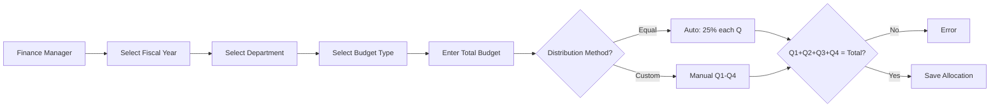
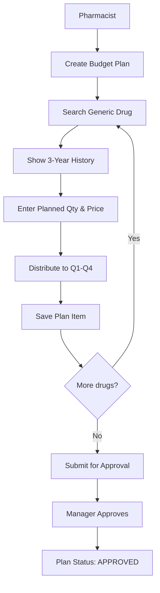
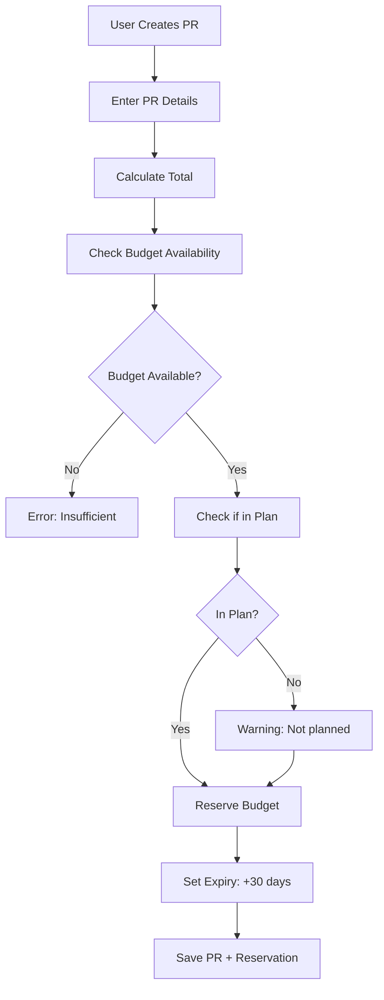
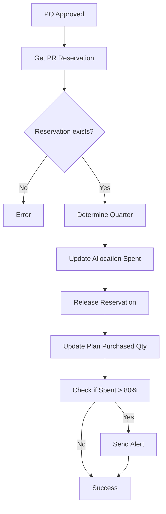
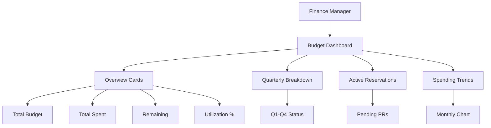

# 📊 Budget Workflow Analysis & Implementation Status

**Created:** 2024-12-08
**Purpose:** Analyze budget workflows and track implementation progress

---

## 🎯 Executive Summary

ระบบ Budget Management ของเรามี **5 Workflows หลัก** ที่ต้องทำงานร่วมกันแบบ **workflow-driven** ไม่ใช่แค่ CRUD ธรรมดา:

| Workflow              | Description                                   | Status              | CRUD Module Exists?                         |
| --------------------- | --------------------------------------------- | ------------------- | ------------------------------------------- |
| 1. Budget Allocation  | จัดสรรงบประจำปี (แบ่งเป็น Q1-Q4)              | ⚠️ CRUD only        | ✅ Yes: `budget-allocations`                |
| 2. Budget Planning    | วางแผนซื้อยาระดับ Generic (พร้อมประวัติ 3 ปี) | ⚠️ CRUD only        | ✅ Yes: `budget-plans`, `budget-plan-items` |
| 3. Budget Reservation | จองงบเมื่อสร้าง PR (หมดอายุ 30 วัน)           | ⚠️ CRUD only        | ✅ Yes: `budget-reservations`               |
| 4. Budget Commitment  | ตัดงบเมื่อ PO approved                        | ❌ Missing workflow | ✅ Module exists (incomplete)               |
| 5. Budget Monitoring  | Dashboard & Reports                           | ❌ Not implemented  | ⚠️ Needs custom UI                          |

**Current State:**

- ✅ **CRUD modules**: All 7 budget tables have basic CRUD
- ❌ **Workflows**: Business logic NOT implemented
- ❌ **UI flows**: Only basic list/edit forms, no workflow screens
- ❌ **Database functions**: PostgreSQL functions not connected

---

## 📋 Workflow Breakdown

### Workflow 1: Budget Allocation (จัดสรรงบประมาณ)

#### Business Flow:



#### What We Have (CRUD):

- ✅ Module: `budget-allocations`
- ✅ API: `POST /api/inventory/master-data/budget-allocations`
- ✅ Fields: fiscal_year, department_id, budget_id, total_budget, q1-q4 budgets, spent, remaining

#### What's Missing (Workflow):

- ❌ **Pre-validation**: Check duplicate allocation
- ❌ **Auto-calculate**: Equal distribution button
- ❌ **Real-time sum check**: Q1+Q2+Q3+Q4 validation
- ❌ **Preview screen**: Show summary before save
- ❌ **Historical data**: Show last year allocation for reference

#### Required UI Components:

```typescript
// Need custom components:
1. FiscalYearSelector (dropdown 2024, 2025, 2026)
2. QuarterlyDistributionForm (4 inputs with sum validation)
3. AutoDistributeButton (calculate 25% each)
4. AllocationPreviewCard (summary before save)
5. DuplicateCheckService (API call before submit)
```

---

### Workflow 2: Budget Planning (วางแผนจัดซื้อยา)

#### Business Flow:



#### What We Have (CRUD):

- ✅ Modules: `budget-plans`, `budget-plan-items`
- ✅ API: Basic CRUD for both tables
- ✅ Fields: plan_name, fiscal_year, items with quantities

#### What's Missing (Workflow):

- ❌ **Historical data**: API to fetch 3-year consumption (last_year_qty, two_years_ago_qty, three_years_ago_qty)
- ❌ **Auto-suggest**: Calculate average + 10% buffer
- ❌ **Plan approval flow**: Status transitions (DRAFT → SUBMITTED → APPROVED)
- ❌ **Plan validation**: Check all items before submit
- ❌ **Total calculation**: Auto-sum total_planned_amount

#### Required UI Components:

```typescript
// Need custom screens:
1. BudgetPlanWizard (step-by-step plan creation)
2. DrugSearchWithHistory (search + show 3-year data)
3. PlanItemForm (qty, price, quarterly distribution)
4. PlanItemsTable (list all drugs in plan)
5. PlanSubmitButton (validate + change status)
6. PlanApprovalPanel (for manager)
```

---

### Workflow 3: Budget Reservation (จองงบเมื่อสร้าง PR)

#### Business Flow:



#### What We Have (CRUD):

- ✅ Module: `budget-reservations`
- ✅ API: Basic CRUD
- ✅ Fields: allocation_id, pr_id, reserved_amount, quarter, reservation_date, expires_date

#### What's Missing (Workflow):

- ❌ **Budget check API**: `check_budget_availability()` function
- ❌ **Auto-reserve**: Triggered when PR created
- ❌ **Expiry logic**: Auto-release after 30 days (cron job)
- ❌ **Plan check**: `check_drug_in_budget_plan()` function
- ❌ **PR integration**: Connect PR creation to reservation

#### Required API Endpoints:

```typescript
// New endpoints needed:
POST /api/budget/check-availability
  Body: { fiscal_year, budget_type_id, department_id, amount, quarter }
  Response: { available: boolean, remaining: number }

POST /api/budget/reserve
  Body: { allocation_id, pr_id, amount, quarter, expires_days }
  Response: { reservation_id, expires_date }

POST /api/budget/reservations/:id/release
  Response: { success: boolean }
```

---

### Workflow 4: Budget Commitment (ตัดงบเมื่อ PO Approved)

#### Business Flow:



#### What We Have (CRUD):

- ⚠️ Partial: `budget-allocations` has spent fields
- ⚠️ Partial: `budget-reservations` has is_released field

#### What's Missing (Workflow):

- ❌ **Commit API**: `commit_budget()` function
- ❌ **Auto-trigger**: When PO status → APPROVED
- ❌ **Transaction log**: Record to budget_transactions table (if exists)
- ❌ **Alert system**: Notify when utilization > 80%
- ❌ **Atomic updates**: Update allocation, release reservation, update plan items

#### Required Implementation:

```typescript
// Event-driven workflow:
1. Listen to PO approval event
2. Execute transaction:
   - Get PR and reservation
   - Calculate quarter from PO date
   - Update budget_allocations (q1_spent, total_spent, remaining)
   - Release reservation (is_released = true)
   - Update budget_plan_items (q1_purchased_qty, total_purchased)
   - Log transaction
3. Check threshold and alert
```

---

### Workflow 5: Budget Monitoring (Dashboard & Reports)

#### Business Flow:



#### What We Have (CRUD):

- ❌ None - only basic list pages

#### What's Missing (Workflow):

- ❌ **Dashboard API**: Aggregate data endpoint
- ❌ **KPI Cards**: Total, spent, remaining, utilization
- ❌ **Charts**: Monthly spending, quarterly breakdown
- ❌ **Tables**: Active reservations list
- ❌ **Filters**: By department, fiscal year, budget type

#### Required Custom Pages:

```typescript
// New pages needed:
/inventory/budget/dashboard
  - Overview KPIs
  - Quarterly progress bars
  - Active reservations table
  - Spending trend chart

/inventory/budget/reports
  - Budget utilization report
  - Department comparison
  - Over-budget alerts
  - Export to Excel
```

---

## 🔧 Database Functions Status

เอกสารระบุว่ามี **6 PostgreSQL functions** ที่ต้องเชื่อมต่อ:

| Function                        | Purpose          | Status           | Used In Workflow |
| ------------------------------- | ---------------- | ---------------- | ---------------- |
| `check_budget_availability()`   | ตรวจสอบงบคงเหลือ | ❌ Not connected | Workflow 3       |
| `reserve_budget()`              | จองงบ            | ❌ Not connected | Workflow 3       |
| `commit_budget()`               | ตัดงบ            | ❌ Not connected | Workflow 4       |
| `release_budget_reservation()`  | ปลดล็อกจองงบ     | ❌ Not connected | Workflow 3, 4    |
| `check_drug_in_budget_plan()`   | เช็คยาในแผน      | ❌ Not connected | Workflow 3       |
| `update_budget_plan_purchase()` | อัพเดตจำนวนซื้อ  | ❌ Not connected | Workflow 4       |

**Action Required:**

```sql
-- Check if functions exist:
SELECT routine_name
FROM information_schema.routines
WHERE routine_schema = 'inventory'
  AND routine_type = 'FUNCTION'
  AND routine_name LIKE '%budget%';
```

---

## 📊 Implementation Gap Analysis

### Current State vs Required State

| Component        | Have             | Need                        | Gap          |
| ---------------- | ---------------- | --------------------------- | ------------ |
| **Backend**      |                  |                             |              |
| - CRUD APIs      | ✅ 7 modules     | ✅ Done                     | -            |
| - Workflow APIs  | ❌ None          | ⚠️ 5 workflows              | **Critical** |
| - DB Functions   | ❌ Not connected | ⚠️ 6 functions              | **Critical** |
| - Business logic | ❌ None          | ⚠️ Validation, calculations | **High**     |
| **Frontend**     |                  |                             |              |
| - List pages     | ✅ Basic         | ✅ Done                     | -            |
| - Form pages     | ✅ Basic         | ✅ Done                     | -            |
| - Workflow UIs   | ❌ None          | ⚠️ 5 custom screens         | **Critical** |
| - Dashboard      | ❌ None          | ⚠️ Monitoring page          | **High**     |
| - Charts         | ❌ None          | ⚠️ Spending trends          | **Medium**   |

---

## 🚀 Recommended Implementation Plan

### Phase 1: Core Workflow APIs (Week 1-2)

**Priority 1: Budget Check & Reserve**

```bash
# 1. Create workflow service file
apps/api/src/modules/inventory/budget/budget-workflow.service.ts

# Functions to implement:
- checkBudgetAvailability(fiscalYear, budgetTypeId, deptId, amount, quarter)
- reserveBudget(allocationId, prId, amount, quarter, expiresDays)
- releaseBudgetReservation(reservationId)
```

**Priority 2: Budget Commitment**

```bash
# 2. Create commitment handler
apps/api/src/modules/inventory/budget/budget-commitment.service.ts

# Functions to implement:
- commitBudget(allocationId, poId, amount, quarter)
- updatePlanPurchases(planId, items, quarter)
- checkBudgetThreshold(allocationId) // Alert if > 80%
```

**Priority 3: Budget Planning Logic**

```bash
# 3. Extend budget-plans service
apps/api/src/modules/inventory/master-data/budget-plans/budget-plans.service.ts

# Add methods:
- getDrugHistory(genericId) // 3-year consumption
- submitPlanForApproval(planId)
- approvePlan(planId, approverId)
- validatePlanCompleteness(planId)
```

### Phase 2: Workflow UI Screens (Week 3-4)

**Priority 1: Budget Allocation Wizard**

```bash
# Create new component
apps/web/src/app/features/inventory/modules/budget-allocations/
  components/
    allocation-wizard.component.ts   # Step-by-step wizard
    quarterly-distribution.component.ts  # Q1-Q4 form
    allocation-preview.component.ts  # Summary card
```

**Priority 2: Budget Planning Screen**

```bash
apps/web/src/app/features/inventory/modules/budget-plans/
  components/
    plan-wizard.component.ts         # Plan creation wizard
    drug-search-history.component.ts # Search + show history
    plan-items-table.component.ts    # Editable table
    plan-approval.component.ts       # Approval panel
```

**Priority 3: Budget Dashboard**

```bash
apps/web/src/app/features/inventory/pages/budget/
  budget-dashboard.page.ts           # Main dashboard
  components/
    budget-overview-cards.component.ts  # KPI cards
    quarterly-chart.component.ts     # Q1-Q4 bar chart
    active-reservations.component.ts # Pending PRs table
    spending-trend-chart.component.ts # Line chart
```

### Phase 3: Integration with PR/PO (Week 5)

**Connect Budget to Procurement:**

```typescript
// When creating PR:
1. Call checkBudgetAvailability()
2. If available → create PR
3. Call reserveBudget() automatically
4. Store reservation_id in PR record

// When PO approved:
1. Listen to PO approval event
2. Get PR reservation
3. Call commitBudget()
4. Release reservation
5. Update plan purchased quantities
```

### Phase 4: Testing & Refinement (Week 6)

- Test all workflows end-to-end
- Verify database functions work correctly
- Test budget alerts (> 80% threshold)
- Test reservation expiry (30-day auto-release)
- Load testing with multiple concurrent reservations

---

## 🎯 Quick Wins (Can Do Now)

### 1. Budget Dashboard (No backend changes needed)

```typescript
// Use existing CRUD APIs to build dashboard
GET /api/inventory/master-data/budget-allocations?fiscal_year=2025
GET /api/inventory/master-data/budget-reservations?is_released=false

// Calculate KPIs client-side:
- Total budget = sum(allocations.total_budget)
- Total spent = sum(allocations.total_spent)
- Remaining = sum(allocations.remaining_budget)
- Utilization = (spent / total) * 100

// Show in dashboard with ax-kpi-card components
```

### 2. Quarterly Distribution Helper

```typescript
// Add to budget-allocation form
function autoDistributeEqual(totalBudget: number) {
  const perQuarter = totalBudget / 4;
  return {
    q1_budget: perQuarter,
    q2_budget: perQuarter,
    q3_budget: perQuarter,
    q4_budget: perQuarter,
  };
}

// Validation
function validateQuarterlySum(form) {
  const sum = form.q1_budget + form.q2_budget + form.q3_budget + form.q4_budget;
  return sum === form.total_budget;
}
```

### 3. Budget Plan Status Filter

```typescript
// Add to budget-plans list page
<mat-button-toggle-group>
  <mat-button-toggle value="DRAFT">Draft</mat-button-toggle>
  <mat-button-toggle value="SUBMITTED">Pending</mat-button-toggle>
  <mat-button-toggle value="APPROVED">Approved</mat-button-toggle>
</mat-button-toggle-group>

// Filter API call
GET /api/inventory/master-data/budget-plans?status=APPROVED
```

---

## 📚 Related Documentation

- [Budget Workflows](../05-workflows/02-budget-WORKFLOWS.md) - Complete workflow diagrams
- [Budget API Guide](../04-api-guides/02-budget-API.md) - API specifications
- [Budget Schema](../02-schema/schema.prisma) - Database tables
- [Database Functions](../02-schema/functions.sql) - PostgreSQL functions

---

## ✅ Action Items Summary

**Immediate (This Week):**

1. [ ] Check if PostgreSQL functions exist in database
2. [ ] Create budget-workflow.service.ts for check/reserve
3. [ ] Build simple budget dashboard with existing APIs

**Short Term (Next 2 Weeks):**

1. [ ] Implement budget commitment workflow
2. [ ] Create budget allocation wizard UI
3. [ ] Add drug history lookup to budget planning

**Medium Term (Month 1):**

1. [ ] Integrate budget with PR creation
2. [ ] Integrate budget commitment with PO approval
3. [ ] Implement budget alerts (>80% utilization)

**Long Term (Month 2+):**

1. [ ] Advanced budget reports
2. [ ] Budget forecasting
3. [ ] Multi-year budget comparison

---

**Last Updated:** 2024-12-08
**Status:** Analysis Complete, Ready for Implementation
