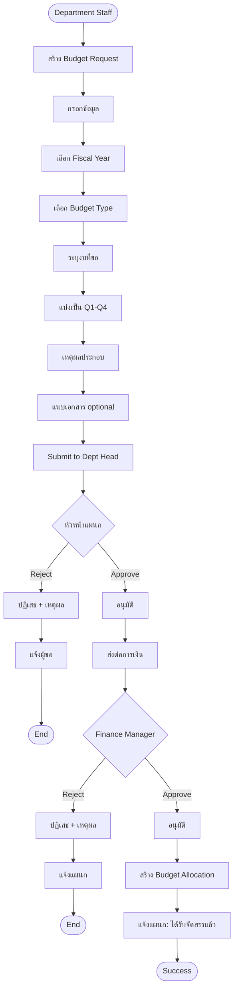

# 📋 Budget Request Workflow (Workflow ที่ขาด)

**Created:** 2024-12-08
**Status:** MISSING - Need to add

---

## ⚠️ ปัญหาที่พบ

ระบบปัจจุบัน **ขาด Workflow การขอจัดสรรงบประมาณ** จากแผนก!

### Flow ที่มีอยู่ (ไม่ถูกต้อง):

```
Finance Manager → สร้าง Budget Allocation → จัดสรรให้แผนก → เสร็จ
```

### Flow ที่ควรมี (ถูกต้อง):

```
1. แผนก → สร้าง Budget Request → ระบุงบที่ต้องการ
2. หัวหน้าแผนก → อนุมัติคำขอ
3. Finance Manager → พิจารณา → อนุมัติ/ปฏิเสธ
4. ระบบ → สร้าง Budget Allocation อัตโนมัติ
```

---

## 🎯 Workflow ที่ต้องเพิ่ม: Budget Request

### User Story:

> **As a** Department Head
> **I want to** request budget allocation for the fiscal year
> **So that** my department has budget to operate

**Acceptance Criteria:**

- ✅ แผนกสามารถขอจัดสรรงบประมาณได้
- ✅ ต้องระบุ fiscal year, budget type, จำนวนเงิน, และแบ่งตาม Q1-Q4
- ✅ แนบเอกสารประกอบได้ (optional)
- ✅ หัวหน้าแผนกต้องอนุมัติก่อนส่งต่อการเงิน
- ✅ Finance Manager พิจารณาและอนุมัติ
- ✅ เมื่ออนุมัติแล้ว สร้าง Budget Allocation อัตโนมัติ

---

## 📊 Process Flow



---

## 🗂️ Database Schema ที่ต้องเพิ่ม

### Table: budget_requests

```sql
CREATE TABLE inventory.budget_requests (
  id BIGSERIAL PRIMARY KEY,
  request_number VARCHAR(20) UNIQUE NOT NULL,     -- BR-2025-001
  fiscal_year INT NOT NULL,
  department_id BIGINT NOT NULL REFERENCES inventory.departments(id),
  budget_type_id BIGINT NOT NULL REFERENCES inventory.budgets(id),

  -- Requested amounts
  requested_total DECIMAL(15,2) NOT NULL,
  requested_q1 DECIMAL(15,2) NOT NULL,
  requested_q2 DECIMAL(15,2) NOT NULL,
  requested_q3 DECIMAL(15,2) NOT NULL,
  requested_q4 DECIMAL(15,2) NOT NULL,

  -- Justification
  reason TEXT NOT NULL,
  attachments JSONB,                           -- [{name, url, size}]

  -- Workflow status
  status VARCHAR(20) NOT NULL DEFAULT 'DRAFT',
  -- DRAFT → SUBMITTED → DEPT_APPROVED → FINANCE_APPROVED → REJECTED

  -- Approval tracking
  requested_by BIGINT NOT NULL REFERENCES users(id),
  requested_at TIMESTAMP DEFAULT NOW(),

  dept_approved_by BIGINT REFERENCES users(id),
  dept_approved_at TIMESTAMP,
  dept_remarks TEXT,

  finance_approved_by BIGINT REFERENCES users(id),
  finance_approved_at TIMESTAMP,
  finance_remarks TEXT,

  rejected_by BIGINT REFERENCES users(id),
  rejected_at TIMESTAMP,
  rejection_reason TEXT,

  -- Link to created allocation
  allocation_id BIGINT REFERENCES inventory.budget_allocations(id),

  created_at TIMESTAMP DEFAULT NOW(),
  updated_at TIMESTAMP DEFAULT NOW(),

  CONSTRAINT check_quarterly_sum CHECK (
    requested_q1 + requested_q2 + requested_q3 + requested_q4 = requested_total
  )
);

CREATE INDEX idx_budget_requests_dept ON inventory.budget_requests(department_id);
CREATE INDEX idx_budget_requests_status ON inventory.budget_requests(status);
CREATE INDEX idx_budget_requests_fiscal_year ON inventory.budget_requests(fiscal_year);
```

### Enum: BudgetRequestStatus

```typescript
enum BudgetRequestStatus {
  DRAFT = 'DRAFT', // แบบร่าง
  SUBMITTED = 'SUBMITTED', // ส่งให้หัวหน้าแผนก
  DEPT_APPROVED = 'DEPT_APPROVED', // หัวหน้าแผนกอนุมัติ
  FINANCE_APPROVED = 'FINANCE_APPROVED', // การเงินอนุมัติ (สร้าง Allocation)
  REJECTED = 'REJECTED', // ปฏิเสธ
}
```

---

## 🚀 API Endpoints ที่ต้องเพิ่ม

### 1. Budget Request Management

```typescript
// List budget requests
GET /api/budget/requests
  Query: ?fiscalYear=2025&departmentId=2&status=SUBMITTED
  Response: { requests: [...] }

// Create budget request
POST /api/budget/requests
  Body: {
    fiscal_year: 2025,
    department_id: 2,
    budget_type_id: 1,
    requested_total: 10000000,
    requested_q1: 2500000,
    requested_q2: 2500000,
    requested_q3: 2500000,
    requested_q4: 2500000,
    reason: "งบประมาณสำหรับจัดซื้อยาและเวชภัณฑ์ประจำปี 2025...",
    attachments: []
  }

// Get budget request detail
GET /api/budget/requests/:id

// Update budget request (DRAFT only)
PUT /api/budget/requests/:id

// Submit to department head
POST /api/budget/requests/:id/submit

// Department head approve
POST /api/budget/requests/:id/dept-approve
  Body: {
    remarks: "อนุมัติ งบประมาณเหมาะสม"
  }

// Department head reject
POST /api/budget/requests/:id/dept-reject
  Body: {
    reason: "งบประมาณสูงเกินไป กรุณาปรับลดลง 20%"
  }

// Finance manager approve
POST /api/budget/requests/:id/finance-approve
  Body: {
    approved_total: 10000000,  // อนุมัติเต็มจำนวน
    approved_q1: 2500000,
    approved_q2: 2500000,
    approved_q3: 2500000,
    approved_q4: 2500000,
    remarks: "อนุมัติตามที่ขอ"
  }
  Action: สร้าง Budget Allocation อัตโนมัติ

// Finance manager reject
POST /api/budget/requests/:id/finance-reject
  Body: {
    reason: "งบประมาณไม่เพียงพอ ปีนี้ลดงบลง 30%"
  }
```

---

## 💻 UI Screens ที่ต้องเพิ่ม

### Screen 1: Budget Request List (แผนก)

```
┌────────────────────────────────────────────────────────────────────┐
│  Budget Requests - Pharmacy Department                            │
├────────────────────────────────────────────────────────────────────┤
│  [+ New Request]                      [Filter: All ▼]  [Search]   │
│                                                                    │
│  ┌──────────────────────────────────────────────────────────────┐ │
│  │ Request No │ FY   │ Amount      │ Status        │ Date       │ │
│  ├──────────────────────────────────────────────────────────────┤ │
│  │ BR-2025-001│ 2025 │ 10,000,000  │ 🟢 APPROVED   │ 2024-12-01 │ │
│  │ BR-2025-002│ 2025 │ 2,000,000   │ 🟡 SUBMITTED  │ 2024-12-05 │ │
│  │ BR-2025-003│ 2025 │ 500,000     │ ⚪ DRAFT      │ 2024-12-07 │ │
│  │ BR-2024-099│ 2024 │ 8,000,000   │ 🔴 REJECTED   │ 2024-10-15 │ │
│  └──────────────────────────────────────────────────────────────┘ │
└────────────────────────────────────────────────────────────────────┘
```

### Screen 2: Create Budget Request

```
┌────────────────────────────────────────────────────────────────────┐
│  Create Budget Request                                      [X]    │
├────────────────────────────────────────────────────────────────────┤
│                                                                    │
│  Fiscal Year: *                                                    │
│  [2025 ▼]                                                          │
│                                                                    │
│  Budget Type: *                                                    │
│  [OP001 - ยาและเวชภัณฑ์ ▼]                                         │
│                                                                    │
│  Requested Amount: *                                               │
│  [10,000,000.00] THB                                               │
│                                                                    │
│  Quarterly Distribution:                                           │
│  ┌──────────────────────────────────────────────────────────────┐ │
│  │ Q1: [2,500,000.00] │ Q2: [2,500,000.00]                      │ │
│  │ Q3: [2,500,000.00] │ Q4: [2,500,000.00]                      │ │
│  │ Total: 10,000,000.00 ✓                                       │ │
│  └──────────────────────────────────────────────────────────────┘ │
│                                                                    │
│  Justification: *                                                  │
│  ┌──────────────────────────────────────────────────────────────┐ │
│  │ ขอจัดสรรงบประมาณสำหรับจัดซื้อยาและเวชภัณฑ์ประจำปี 2025     │ │
│  │ โดยคาดการณ์จากสถิติการใช้ยา 3 ปีย้อนหลัง                     │ │
│  │ และเพิ่ม 10% เนื่องจากจำนวนผู้ป่วยเพิ่มขึ้น                  │ │
│  └──────────────────────────────────────────────────────────────┘ │
│                                                                    │
│  Attachments:                                                      │
│  [+ Upload Files]                                                  │
│                                                                    │
│  [Cancel]                    [Save Draft]    [Submit for Approval]│
└────────────────────────────────────────────────────────────────────┘
```

### Screen 3: Budget Request Approval (หัวหน้าแผนก)

```
┌────────────────────────────────────────────────────────────────────┐
│  Budget Request Approval                                           │
├────────────────────────────────────────────────────────────────────┤
│  Request No: BR-2025-002                                           │
│  Department: Pharmacy Department                                   │
│  Requested By: นางสาว A (Pharmacist)                               │
│  Requested Date: 2024-12-05                                        │
│                                                                    │
│  ┌──────────────────────────────────────────────────────────────┐ │
│  │ Fiscal Year: 2025                                            │ │
│  │ Budget Type: OP001 - ยาและเวชภัณฑ์                           │ │
│  │ Requested Amount: 10,000,000.00 THB                          │ │
│  │                                                              │ │
│  │ Quarterly Breakdown:                                         │ │
│  │ Q1: 2,500,000 │ Q2: 2,500,000 │ Q3: 2,500,000 │ Q4: 2,500,000│ │
│  └──────────────────────────────────────────────────────────────┘ │
│                                                                    │
│  Justification:                                                    │
│  ┌──────────────────────────────────────────────────────────────┐ │
│  │ ขอจัดสรรงบประมาณสำหรับจัดซื้อยาและเวชภัณฑ์ประจำปี 2025...  │ │
│  └──────────────────────────────────────────────────────────────┘ │
│                                                                    │
│  Remarks (Optional):                                               │
│  [อนุมัติตามที่ขอ งบประมาณเหมาะสมกับปริมาณผู้ป่วย]              │
│                                                                    │
│  [Reject]                                          [Approve]       │
└────────────────────────────────────────────────────────────────────┘
```

### Screen 4: Budget Request Approval (Finance)

```
┌────────────────────────────────────────────────────────────────────┐
│  Budget Request - Finance Approval                                 │
├────────────────────────────────────────────────────────────────────┤
│  Request No: BR-2025-002                                           │
│  Department: Pharmacy Department                                   │
│  Dept Head Approved: ✓ นาย B (Head of Pharmacy)                   │
│                                                                    │
│  Requested Amount: 10,000,000.00 THB                               │
│                                                                    │
│  Available Budget Pool: 50,000,000.00 THB                          │
│  Already Allocated: 30,000,000.00 THB                              │
│  Remaining: 20,000,000.00 THB                                      │
│                                                                    │
│  ⚠️ If approved, remaining: 10,000,000.00 THB                      │
│                                                                    │
│  Approve Amount:                                                   │
│  ○ Full amount (10,000,000.00)                                     │
│  ○ Partial amount: [__________.00] THB                             │
│                                                                    │
│  If partial, adjust quarterly:                                     │
│  Q1: [______] │ Q2: [______] │ Q3: [______] │ Q4: [______]         │
│                                                                    │
│  Remarks:                                                          │
│  [อนุมัติเต็มจำนวน]                                               │
│                                                                    │
│  [Reject]                                          [Approve]       │
└────────────────────────────────────────────────────────────────────┘
```

---

## 📋 Implementation Checklist

### Database:

```sql
□ Create budget_requests table
□ Add BudgetRequestStatus enum
□ Create indexes
□ Add foreign keys
```

### Backend APIs:

```typescript
□ GET    /api/budget/requests
□ POST   /api/budget/requests
□ GET    /api/budget/requests/:id
□ PUT    /api/budget/requests/:id
□ POST   /api/budget/requests/:id/submit
□ POST   /api/budget/requests/:id/dept-approve
□ POST   /api/budget/requests/:id/dept-reject
□ POST   /api/budget/requests/:id/finance-approve
□ POST   /api/budget/requests/:id/finance-reject
```

### Frontend Screens:

```typescript
□ Budget Request List page
□ Create Budget Request wizard
□ Budget Request Detail page
□ Department Approval interface
□ Finance Approval interface
```

### Business Logic:

```typescript
□ Status transition validation (DRAFT → SUBMITTED → DEPT_APPROVED → FINANCE_APPROVED)
□ Auto-create Budget Allocation when finance approves
□ Notification system (email/alert)
□ Attachment upload/download
```

---

## 🔄 Updated Complete Budget Workflow

```
Phase 0: Budget Request (NEW - ต้องเพิ่ม)
  1. แผนกสร้างคำขอ
  2. หัวหน้าแผนกอนุมัติ
  3. Finance พิจารณา
  4. สร้าง Allocation อัตโนมัติ

Phase 1: Budget Allocation (ที่มีอยู่)
  1. Finance จัดสรรงบให้แผนก
  2. แบ่งเป็น Q1-Q4

Phase 2: Budget Planning (ที่มีอยู่)
  1. แผนกวางแผนซื้อยา
  2. Drug-level planning

Phase 3: Budget Reservation (ที่มีอยู่)
  1. จองงบเมื่อสร้าง PR

Phase 4: Budget Commitment (ที่มีอยื่)
  1. ตัดงบเมื่อ PO approved
```

---

## ✅ Conclusion

**Workflow ที่ขาด: Budget Request & Approval**

ต้องเพิ่ม workflow การขอจัดสรรงบประมาณ เพื่อให้:

1. ✅ แผนกสามารถขอจัดสรรงบเองได้
2. ✅ มี approval flow ที่ชัดเจน
3. ✅ ติดตามประวัติการขอได้
4. ✅ Finance มีข้อมูลประกอบการตัดสินใจ

**Estimated Time to Implement:**

- Database + APIs: 2-3 วัน
- Frontend UI: 3-4 วัน
- Testing: 1-2 วัน
- **Total: 1-1.5 สัปดาห์**

---

**Last Updated:** 2024-12-08
**Priority:** HIGH - Should be added before Budget Allocation
