# 01. Workflow Analysis - Budget Request Submission

**Version:** 1.0.0
**Date:** 2025-12-12

[← Back to Index](./README.md)

---

## 📋 Table of Contents

1. [Current Status Flow](#current-status-flow)
2. [Database Schema Analysis](#database-schema-analysis)
3. [Status Transition Rules](#status-transition-rules)
4. [Actors and Roles](#actors-and-roles)
5. [Workflow Diagrams](#workflow-diagrams)
6. [Issues with Current Flow](#issues-with-current-flow)
7. [Proposed Improvements](#proposed-improvements)

---

## Current Status Flow

### Status Enum Values

```sql
-- From: inventory.budget_request_status
DRAFT            -- เริ่มต้น สร้างใหม่
SUBMITTED        -- ส่งขออนุมัติแล้ว
DEPT_APPROVED    -- หัวหน้าแผนกอนุมัติแล้ว
FINANCE_APPROVED -- การเงินอนุมัติแล้ว (สถานะสุดท้าย)
REJECTED         -- ถูกปฏิเสธ
```

### Current State Machine


---

## Database Schema Analysis

### Main Table: `inventory.budget_requests`

**Key Fields:**

| Field                    | Type          | Purpose                     | Current Usage                               |
| ------------------------ | ------------- | --------------------------- | ------------------------------------------- |
| `id`                     | bigint        | Primary key                 | ✅ Auto-increment                           |
| `request_number`         | varchar(50)   | เลขที่คำขอ                  | ✅ Unique (BR-YYYY-XXX)                     |
| `fiscal_year`            | integer       | ปีงบประมาณ                  | ✅ Used                                     |
| `department_id`          | integer       | แผนกที่ขอ                   | ⚠️ Nullable (should be required)            |
| `status`                 | enum          | สถานะปัจจุบัน               | ✅ Used                                     |
| `total_requested_amount` | numeric(15,2) | ยอดรวมที่ขอ                 | ✅ Auto-calculated                          |
| `justification`          | text          | เหตุผลในการขอ               | ⚠️ Optional (should be required for submit) |
| **Submission Tracking**  |               |                             |                                             |
| `submitted_by`           | uuid          | ผู้ submit                  | ✅ FK to users                              |
| `submitted_at`           | timestamptz   | เวลา submit                 | ✅ Tracked                                  |
| **Department Review**    |               |                             |                                             |
| `dept_reviewed_by`       | uuid          | หัวหน้าแผนกผู้อนุมัติ       | ✅ FK to users                              |
| `dept_reviewed_at`       | timestamptz   | เวลาอนุมัติ                 | ✅ Tracked                                  |
| `dept_comments`          | text          | ความเห็นหัวหน้าแผนก         | ✅ Optional                                 |
| **Finance Review**       |               |                             |                                             |
| `finance_reviewed_by`    | uuid          | ผู้จัดการการเงินผู้อนุมัติ  | ✅ FK to users                              |
| `finance_reviewed_at`    | timestamptz   | เวลาอนุมัติ                 | ✅ Tracked                                  |
| `finance_comments`       | text          | ความเห็นผู้จัดการการเงิน    | ✅ Optional                                 |
| **Rejection**            |               |                             |                                             |
| `rejection_reason`       | text          | เหตุผลถูกปฏิเสธ             | ✅ Tracked                                  |
| **Reopen/Amendment**     |               |                             |                                             |
| `reopened_by`            | uuid          | ผู้ reopen                  | ⚠️ Not used yet                             |
| `reopened_at`            | timestamptz   | เวลา reopen                 | ⚠️ Not used yet                             |
| `parent_request_id`      | bigint        | คำขอต้นฉบับ (กรณี revision) | ⚠️ Not used yet                             |
| **Aggregation**          |               |                             |                                             |
| `is_aggregated`          | boolean       | รวมจากหลายคำขอ              | ⚠️ Not used yet                             |
| `aggregated_at`          | timestamptz   | เวลารวม                     | ⚠️ Not used yet                             |

### Related Table: `inventory.budget_request_items`

**Key Fields:**

| Field                                  | Type    | Purpose               | Current Usage         |
| -------------------------------------- | ------- | --------------------- | --------------------- |
| `budget_request_id`                    | bigint  | FK to budget_requests | ✅ Used               |
| `line_number`                          | integer | ลำดับรายการ           | ✅ Used               |
| `generic_id`                           | bigint  | FK to drug_generics   | ✅ Used               |
| `requested_qty`                        | numeric | จำนวนที่ขอ            | ✅ Used               |
| `unit_price`                           | numeric | ราคาต่อหน่วย          | ✅ Used               |
| `requested_amount`                     | numeric | ยอดรวม (qty \* price) | ✅ Auto-calculated    |
| `q1_qty`, `q2_qty`, `q3_qty`, `q4_qty` | numeric | แบ่งตามไตรมาส         | ✅ Used               |
| `budget_type_id`                       | bigint  | ประเภทงบ              | ✅ Used               |
| `budget_category_id`                   | bigint  | หมวดงบ                | ✅ Used               |
| `ed_category`                          | varchar | ED/NED/CM/NDMS        | ✅ From drug_generics |
| `tmt_gpu_code`                         | varchar | รหัส TMT GPU          | ✅ From drug_generics |
| `working_code`                         | varchar | รหัสยา                | ✅ From drug_generics |

---

## Status Transition Rules

### 1. DRAFT → SUBMITTED

**Trigger:** User clicks "Submit for Approval"

**Pre-conditions:**

- ✅ Must have at least 1 item
- ⚠️ Should have justification (not enforced)
- ⚠️ Should have department_id (not enforced)
- ⚠️ Items should have valid budget types (not checked)

**Actions:**

1. Set `status = 'SUBMITTED'`
2. Set `submitted_by = current_user.id`
3. Set `submitted_at = NOW()`
4. **TODO:** Send notification to department head

**Post-conditions:**

- Status is SUBMITTED
- Can no longer edit items
- Waiting for department approval

**Current Implementation:**

```typescript
// Frontend: apps/web/.../budget-requests.service.ts
async submitBudgetRequest(id: number): Promise<BudgetRequest>

// Backend: NOT IMPLEMENTED YET (need to create)
// Should be: POST /inventory/budget/budget-requests/:id/submit
```

---

### 2. SUBMITTED → DEPT_APPROVED

**Trigger:** Department Head clicks "Approve"

**Pre-conditions:**

- ✅ Status must be SUBMITTED
- ⚠️ Current user must be department head (not enforced)
- ⚠️ Department head must belong to same department (not enforced)

**Actions:**

1. Set `status = 'DEPT_APPROVED'`
2. Set `dept_reviewed_by = current_user.id`
3. Set `dept_reviewed_at = NOW()`
4. Set `dept_comments` (optional)
5. **TODO:** Send notification to finance manager

**Post-conditions:**

- Status is DEPT_APPROVED
- Waiting for finance approval

**Current Implementation:**

```typescript
// Frontend: apps/web/.../budget-requests.service.ts
async approveDepartment(id: number, comments?: string): Promise<BudgetRequest>

// Backend: NOT IMPLEMENTED YET
// Should be: POST /inventory/budget/budget-requests/:id/approve-dept
```

---

### 3. DEPT_APPROVED → FINANCE_APPROVED

**Trigger:** Finance Manager clicks "Approve"

**Pre-conditions:**

- ✅ Status must be DEPT_APPROVED
- ⚠️ Current user must be finance manager (not enforced)
- ⚠️ Should check budget availability (not implemented)

**Actions:**

1. Set `status = 'FINANCE_APPROVED'`
2. Set `finance_reviewed_by = current_user.id`
3. Set `finance_reviewed_at = NOW()`
4. Set `finance_comments` (optional)
5. **TODO:** Create budget plan items (if not exists)
6. **TODO:** Link to budget allocations
7. **TODO:** Send notification to requester

**Post-conditions:**

- Status is FINANCE_APPROVED (final state)
- Budget request is approved
- Ready for procurement process

**Current Implementation:**

```typescript
// Frontend: apps/web/.../budget-requests.service.ts
async approveFinance(id: number, comments?: string): Promise<BudgetRequest>

// Backend: NOT IMPLEMENTED YET
// Should be: POST /inventory/budget/budget-requests/:id/approve-finance
```

---

### 4. Any → REJECTED

**Trigger:** Approver clicks "Reject"

**Pre-conditions:**

- Status must be SUBMITTED or DEPT_APPROVED
- Current user must have approval permission

**Actions:**

1. Set `status = 'REJECTED'`
2. Set rejection fields based on who rejected:
   - If dept head: `dept_reviewed_by`, `dept_reviewed_at`
   - If finance: `finance_reviewed_by`, `finance_reviewed_at`
3. Set `rejection_reason` (REQUIRED)
4. Send notification to requester

**Post-conditions:**

- Status is REJECTED
- Can be reopened (if allowed)

**Current Implementation:**

```typescript
// NOT IMPLEMENTED YET
// Should be: POST /inventory/budget/budget-requests/:id/reject
// Body: { rejection_reason: string }
```

---

### 5. REJECTED → DRAFT (Reopen)

**Trigger:** User clicks "Reopen" to edit and resubmit

**Pre-conditions:**

- Status must be REJECTED
- User must be original requester OR department head
- **TODO:** Define reopen policy (how many times? time limit?)

**Actions:**

1. Set `status = 'DRAFT'`
2. Set `reopened_by = current_user.id`
3. Set `reopened_at = NOW()`
4. Clear review fields: `submitted_by`, `submitted_at`, `dept_reviewed_by`, etc.
5. Keep `rejection_reason` for audit trail

**Post-conditions:**

- Status is DRAFT
- Can edit items again
- Can resubmit

**Current Implementation:**

```typescript
// PARTIALLY IMPLEMENTED (need to verify)
// The fields exist but workflow may not be complete
```

---

## Actors and Roles

### 1. Pharmacist / Staff (Requester)

**Responsibilities:**

- สร้าง Budget Request ใหม่
- เพิ่ม/แก้ไข/ลบรายการยา (ในสถานะ DRAFT)
- กรอก Justification
- Submit for approval
- Reopen rejected requests (if allowed)

**Permissions Required:**

- `budget_requests.create`
- `budget_requests.update` (own requests, DRAFT only)
- `budget_requests.submit`
- `budget_requests.reopen` (own rejected requests)

---

### 2. Department Head (หัวหน้าแผนก)

**Responsibilities:**

- Review budget requests from their department
- Approve or reject SUBMITTED requests
- Add comments/feedback
- View all requests in their department

**Permissions Required:**

- `budget_requests.view_department` (all in their dept)
- `budget_requests.approve_dept`
- `budget_requests.reject`

**Business Rules:**

- Can only approve requests from their own department
- Cannot approve their own requests (conflict of interest)

---

### 3. Finance Manager (ผู้จัดการการเงิน)

**Responsibilities:**

- Review DEPT_APPROVED requests from all departments
- Check budget availability
- Final approval or rejection
- Add comments/conditions

**Permissions Required:**

- `budget_requests.view_all` (all departments)
- `budget_requests.approve_finance`
- `budget_requests.reject`
- `budget_allocations.view` (to check budget)

**Business Rules:**

- Can approve requests from any department
- Should check budget allocation before approving
- Can add conditions (e.g., "approved for 80% of requested amount")

---

### 4. Admin / Super User

**Responsibilities:**

- View all requests
- Override rejections (if necessary)
- Manage permissions
- Generate reports

**Permissions Required:**

- `budget_requests.*` (all permissions)

---

## Workflow Diagrams

### Complete Submission Flow

```mermaid
sequenceDiagram
    actor Pharmacist
    actor DeptHead as Department Head
    actor FinanceMgr as Finance Manager
    participant System
    participant DB as Database
    participant Budget as Budget System

    %% Phase 1: Create and Submit
    Pharmacist->>System: 1. Create Budget Request (DRAFT)
    System->>DB: Save with status=DRAFT

    Pharmacist->>System: 2. Add drug items
    System->>DB: Save items

    Pharmacist->>System: 3. Click "Submit"
    System->>System: Validate (has items? has justification?)

    alt Validation Failed
        System-->>Pharmacist: ❌ Show validation errors
    else Validation Passed
        System->>DB: Update status=SUBMITTED, set submitted_by/at
        System->>DeptHead: 📧 Notify: New request pending
        System-->>Pharmacist: ✅ Submitted successfully
    end

    %% Phase 2: Department Approval
    DeptHead->>System: 4. Review request
    System->>DB: Load request + items
    System-->>DeptHead: Display for review

    DeptHead->>System: 5. Decision (Approve/Reject)

    alt Rejected
        System->>DB: Update status=REJECTED, set rejection_reason
        System->>Pharmacist: 📧 Notify: Request rejected
    else Approved
        System->>DB: Update status=DEPT_APPROVED, set dept_reviewed_by/at
        System->>FinanceMgr: 📧 Notify: Request needs finance approval
        System-->>DeptHead: ✅ Approved successfully
    end

    %% Phase 3: Finance Approval
    FinanceMgr->>System: 6. Review request
    System->>Budget: Check budget availability
    Budget-->>System: Budget status
    System-->>FinanceMgr: Display request + budget info

    FinanceMgr->>System: 7. Decision (Approve/Reject)

    alt Rejected
        System->>DB: Update status=REJECTED, set rejection_reason
        System->>Pharmacist: 📧 Notify: Request rejected by finance
    else Approved
        System->>DB: Update status=FINANCE_APPROVED, set finance_reviewed_by/at
        System->>Budget: Update budget allocation (if needed)
        System->>Pharmacist: 📧 Notify: Request approved!
        System-->>FinanceMgr: ✅ Approved successfully
    end
```



---

## Issues with Current Flow

### 🔴 Critical Issues

1. **No Permission Control**
   - ❌ Anyone can submit/approve (no role checking)
   - ❌ No department-based access control
   - ❌ Can approve own requests (conflict of interest)

2. **No Validation Before Submit**
   - ❌ Can submit empty request (0 items)
   - ❌ Can submit without justification
   - ❌ Can submit without department
   - ❌ No check for duplicate items

3. **No Budget Integration**
   - ❌ No check against budget allocations
   - ❌ No link to budget plans
   - ❌ Cannot track budget usage

4. **Missing API Endpoints**
   - ❌ Submit endpoint not implemented
   - ❌ Approve endpoints not implemented
   - ❌ Reject endpoint not implemented

---

### 🟡 Medium Priority Issues

5. **No Notifications**
   - ⚠️ No email/system notifications
   - ⚠️ Approvers don't know when there's pending work

6. **Incomplete Reopen Flow**
   - ⚠️ Reopen fields exist but workflow unclear
   - ⚠️ No policy on how many times can reopen

7. **No Dashboard**
   - ⚠️ Cannot see overview of all requests
   - ⚠️ No metrics (how many pending, approved, etc.)

8. **Limited Audit Trail**
   - ⚠️ Have audit table but not fully utilized
   - ⚠️ Cannot see full history of changes

---

### 🟢 Nice-to-Have Issues

9. **No Batch Operations**
   - ℹ️ Cannot approve multiple requests at once
   - ℹ️ No bulk import for items

10. **No Advanced Features**
    - ℹ️ No delegation (assign someone else to approve)
    - ℹ️ No escalation (auto-approve after X days)
    - ℹ️ No conditional approval (approve with adjustments)

---

## Proposed Improvements

### Phase 1: Essential Fixes (Must Have)

1. **Implement Permission System** → See [02-PERMISSION-MATRIX.md](./02-PERMISSION-MATRIX.md)
   - Add role-based access control
   - Implement department-based filtering
   - Prevent conflict of interest

2. **Add Pre-submission Validation** → See [03-VALIDATION-RULES.md](./03-VALIDATION-RULES.md)
   - Enforce required fields
   - Check for valid items
   - Validate against business rules

3. **Create Missing API Endpoints**
   - POST /:id/submit
   - POST /:id/approve-dept
   - POST /:id/approve-finance
   - POST /:id/reject
   - POST /:id/reopen

4. **Budget Integration** → See [06-INTEGRATION-SPEC.md](./06-INTEGRATION-SPEC.md)
   - Check budget availability before approval
   - Link to budget plans
   - Update allocations after approval

---

### Phase 2: Important Features (Should Have)

5. **Add Dashboard** → See [04-DASHBOARD-SPEC.md](./04-DASHBOARD-SPEC.md)
   - Overview of all requests by status
   - Budget utilization metrics
   - Pending approvals count

6. **Improve UX** → See [05-UI-UX-IMPROVEMENTS.md](./05-UI-UX-IMPROVEMENTS.md)
   - Progress indicator
   - Validation feedback
   - Clear action buttons

7. **Notification System**
   - Email notifications
   - In-app notifications
   - Notification preferences

---

### Phase 3: Advanced Features (Nice to Have)

8. **Batch Operations**
   - Approve multiple requests
   - Bulk import items

9. **Workflow Enhancements**
   - Delegation
   - Escalation
   - Conditional approval

---

## Next Steps

1. ✅ Read this document to understand current flow
2. ⏭️ Read [02-PERMISSION-MATRIX.md](./02-PERMISSION-MATRIX.md) for permission design
3. ⏭️ Read [03-VALIDATION-RULES.md](./03-VALIDATION-RULES.md) for validation rules
4. ⏭️ Approve and prioritize improvements
5. ⏭️ Start implementation

---

[← Back to Index](./README.md) | [Next: Permission Matrix →](./02-PERMISSION-MATRIX.md)
