```mermaid
sequenceDiagram
    actor Finance as Finance Manager
    participant BRService as Budget Request Service
    participant BAService as Budget Allocation Service
    participant DB as Database

    Finance->>BRService: Click "Approve"

    BRService->>BAService: Check budget availability
    Note over BAService: fiscal_year: 2568<br/>department_id: 2<br/>amount: 2,500,000

    BAService->>DB: SELECT * FROM budget_allocations<br/>WHERE fiscal_year = 2568<br/>AND department_id = 2

    DB-->>BAService: allocations[]

    BAService->>BAService: Calculate:<br/>- Total allocated<br/>- Total used<br/>- Total reserved<br/>- Available = allocated - used - reserved

    alt Sufficient budget
        BAService-->>BRService: { available: true, remaining: 3M }
        BRService->>BRService: Update status = FINANCE_APPROVED
        BRService->>BAService: Update budget used
        BAService->>DB: UPDATE budget_allocations<br/>SET total_used += 2.5M
    else Insufficient budget
        BAService-->>BRService: { available: false, shortage: 500K }
        BRService-->>Finance: ❌ Error: Insufficient budget
    end
```

# 06. Integration Specification

**Version:** 1.0.0
**Date:** 2025-12-12

[← Back to Index](./README.md) | [← Previous: UI/UX Improvements](./05-UI-UX-IMPROVEMENTS.md)

---

## 📋 Table of Contents

1. [Overview](#overview)
2. [Budget Plans Integration](#budget-plans-integration)
3. [Budget Allocations Integration](#budget-allocations-integration)
4. [Budget Reservations Integration](#budget-reservations-integration)
5. [Audit Trail Integration](#audit-trail-integration)
6. [Notification System Integration](#notification-system-integration)
7. [Data Flow Diagrams](#data-flow-diagrams)

---

## Overview

Budget Request ต้องเชื่อมโยงกับระบบอื่นๆ ดังนี้:

1. **Budget Plans** - ตรวจสอบว่ายาอยู่ในแผนหรือไม่
2. **Budget Allocations** - ตรวจสอบงบประมาณคงเหลือ
3. **Budget Reservations** - จองงบเมื่อ submit (future feature)
4. **Audit Trail** - บันทึกทุก action
5. **Notifications** - แจ้งเตือนผู้ที่เกี่ยวข้อง

---

## Budget Plans Integration

### Check if Drug is in Plan

**Use Case:** ก่อน submit ตรวจสอบว่ายาที่ขออยู่ใน approved budget plan หรือไม่

**Flow:**


### API Endpoint

```typescript
/**
 * Check if drugs are in approved budget plan
 */
POST /inventory/budget/budget-plans/check-drugs

Request Body:
{
  "fiscal_year": 2568,
  "department_id": 2,
  "drug_ids": [101, 102, 103, ...]
}

Response:
{
  "plan_exists": true,
  "plan_id": 5,
  "plan_name": "แผนจัดซื้อยาประจำปี 2568",
  "plan_status": "APPROVED",
  "results": [
    {
      "generic_id": 101,
      "generic_name": "Paracetamol 500mg TAB",
      "in_plan": true,
      "planned_qty": 50000,
      "requested_qty": 5000,
      "variance_percent": -90
    },
    {
      "generic_id": 102,
      "generic_name": "Ibuprofen 400mg TAB",
      "in_plan": false,
      "warning": "Drug not in budget plan"
    }
  ],
  "summary": {
    "total_drugs": 45,
    "in_plan": 42,
    "not_in_plan": 3
  }
}
```

### Backend Implementation

```typescript
// apps/api/src/modules/inventory/operations/budgetPlans/budget-plans.service.ts

export class BudgetPlansService {
  /**
   * Check which drugs are in approved budget plan
   */
  async checkDrugsInPlan(params: { fiscal_year: number; department_id: number; drug_ids: number[] }): Promise<CheckDrugsInPlanResult> {
    // 1. Find approved plan
    const plan = await this.repository.findOne({
      where: {
        fiscal_year: params.fiscal_year,
        department_id: params.department_id,
        status: 'APPROVED',
        is_active: true,
      },
    });

    if (!plan) {
      return {
        plan_exists: false,
        results: params.drug_ids.map((id) => ({
          generic_id: id,
          in_plan: false,
          warning: 'No approved budget plan found for this year',
        })),
        summary: {
          total_drugs: params.drug_ids.length,
          in_plan: 0,
          not_in_plan: params.drug_ids.length,
        },
      };
    }

    // 2. Get plan items
    const planItems = await this.planItemsRepository.find({
      where: { budget_plan_id: plan.id },
      select: ['generic_id', 'planned_quantity'],
    });

    const planDrugMap = new Map(planItems.map((item) => [item.generic_id, item]));

    // 3. Check each drug
    const results = params.drug_ids.map((drugId) => {
      const planItem = planDrugMap.get(drugId);

      if (planItem) {
        return {
          generic_id: drugId,
          in_plan: true,
          planned_qty: planItem.planned_quantity,
        };
      } else {
        return {
          generic_id: drugId,
          in_plan: false,
          warning: 'Drug not in budget plan',
        };
      }
    });

    return {
      plan_exists: true,
      plan_id: plan.id,
      plan_name: plan.plan_name,
      plan_status: plan.status,
      results,
      summary: {
        total_drugs: params.drug_ids.length,
        in_plan: results.filter((r) => r.in_plan).length,
        not_in_plan: results.filter((r) => !r.in_plan).length,
      },
    };
  }
}
```

---

## Budget Allocations Integration

### Check Budget Availability

**Use Case:** ก่อน Finance approve ต้องตรวจสอบว่างบประมาณเพียงพอหรือไม่

**Flow:**



### API Endpoint

```typescript
/**
 * Check budget availability
 */
POST /inventory/budget/allocations/check-availability

Request Body:
{
  "fiscal_year": 2568,
  "department_id": 2,
  "budget_type_id": 1,
  "amount": 2500000,
  "quarter": 2  // optional
}

Response:
{
  "available": true,
  "allocation": {
    "id": 10,
    "total_budget": 10000000,
    "total_used": 6500000,
    "total_reserved": 500000,
    "remaining_budget": 3000000
  },
  "quarterly": {
    "q1": { allocated: 2500000, used: 2500000, available: 0 },
    "q2": { allocated: 2500000, used: 2000000, available: 500000 },
    "q3": { allocated: 2500000, used: 1500000, available: 1000000 },
    "q4": { allocated: 2500000, used: 500000, available: 2000000 }
  },
  "impact": {
    "before": {
      "available": 3000000,
      "utilization_percent": 65
    },
    "after": {
      "available": 500000,
      "utilization_percent": 83.3
    }
  },
  "warnings": [
    "Budget utilization will reach 83% after this approval"
  ]
}
```

### Update Budget After Approval

```typescript
/**
 * Update budget allocation when request is approved
 */
async approveFinance(requestId: number, userId: string): Promise<void> {
  const request = await this.budgetRequestRepository.findById(requestId);

  // 1. Check budget availability
  const budgetCheck = await this.budgetAllocationService.checkAvailability({
    fiscal_year: request.fiscal_year,
    department_id: request.department_id,
    budget_type_id: request.items[0].budget_type_id, // Assume same type
    amount: request.total_requested_amount
  });

  if (!budgetCheck.available) {
    throw new BadRequestException('Insufficient budget allocation');
  }

  // 2. Use transaction to ensure atomicity
  await this.db.transaction(async (tx) => {
    // Update request status
    await tx.budgetRequests.update({
      where: { id: requestId },
      data: {
        status: 'FINANCE_APPROVED',
        finance_reviewed_by: userId,
        finance_reviewed_at: new Date()
      }
    });

    // Update budget allocation
    await tx.budgetAllocations.update({
      where: { id: budgetCheck.allocation.id },
      data: {
        total_used: {
          increment: request.total_requested_amount
        },
        remaining_budget: {
          decrement: request.total_requested_amount
        }
      }
    });

    // Create audit record
    await tx.budgetRequestAudit.create({
      data: {
        budget_request_id: requestId,
        action: 'FINANCE_APPROVED',
        performed_by: userId,
        old_status: 'DEPT_APPROVED',
        new_status: 'FINANCE_APPROVED',
        changes: {
          budget_allocated: request.total_requested_amount
        }
      }
    });
  });
}
```

---

## Budget Reservations Integration

**Note:** This is a **future feature** - not currently implemented

### Reserve Budget on Submit

**Use Case:** เมื่อ submit คำขอ ให้จองงบไว้ชั่วคราว (prevent overspending)

**Flow:**



```mermaid
sequenceDiagram
    actor User
    participant BRService as Budget Request Service
    participant ResvService as Reservation Service
    participant DB as Database

    User->>BRService: Submit request

    BRService->>ResvService: Reserve budget
    Note over ResvService: amount: 2.5M<br/>expires: +30 days

    ResvService->>DB: INSERT INTO budget_reservations
    DB-->>ResvService: reservation_id

    ResvService->>DB: UPDATE budget_allocations<br/>SET total_reserved += 2.5M

    ResvService-->>BRService: { reservation_id: 123 }

    BRService->>DB: UPDATE budget_requests<br/>SET reservation_id = 123

    BRService-->>User: ✅ Submitted & Budget Reserved
```

### Release Reservation

**When:**

- Request rejected → release immediately
- Request approved → convert to actual usage
- Reservation expired (>30 days) → auto-release

```typescript
/**
 * Release budget reservation
 */
async releaseBudgetReservation(requestId: number): Promise<void> {
  const request = await this.budgetRequestRepository.findById(requestId);

  if (!request.reservation_id) {
    return; // No reservation to release
  }

  const reservation = await this.reservationRepository.findById(request.reservation_id);

  await this.db.transaction(async (tx) => {
    // Mark reservation as released
    await tx.budgetReservations.update({
      where: { id: reservation.id },
      data: {
        is_released: true,
        released_at: new Date()
      }
    });

    // Update allocation (decrease reserved amount)
    await tx.budgetAllocations.update({
      where: { id: reservation.allocation_id },
      data: {
        total_reserved: {
          decrement: reservation.reserved_amount
        }
      }
    });
  });
}
```

---

## Audit Trail Integration

### Record Every Action

**Use Case:** บันทึก audit trail ทุกครั้งที่มี action สำคัญ

**Table:** `inventory.budget_request_audit`

**Events to Audit:**

- ✅ Created
- ✅ Updated (items added/modified/deleted)
- ✅ Submitted
- ✅ Department Approved
- ✅ Department Rejected
- ✅ Finance Approved
- ✅ Finance Rejected
- ✅ Reopened

### Implementation

```typescript
// apps/api/src/modules/inventory/operations/budgetRequests/budget-requests.service.ts

export class BudgetRequestsService {
  /**
   * Create audit record
   */
  private async createAuditRecord(params: { budget_request_id: number; action: string; performed_by: string; old_status?: string; new_status?: string; changes?: any; comments?: string }): Promise<void> {
    await this.auditRepository.create({
      budget_request_id: params.budget_request_id,
      action: params.action,
      performed_by: params.performed_by,
      performed_at: new Date(),
      old_status: params.old_status,
      new_status: params.new_status,
      changes: params.changes,
      comments: params.comments,
      ip_address: this.getClientIP(),
      user_agent: this.getUserAgent(),
    });
  }

  /**
   * Submit request (with audit)
   */
  async submitBudgetRequest(id: number, userId: string): Promise<BudgetRequest> {
    const request = await this.repository.findById(id);

    await this.db.transaction(async (tx) => {
      // Update request
      await tx.budgetRequests.update({
        where: { id },
        data: {
          status: 'SUBMITTED',
          submitted_by: userId,
          submitted_at: new Date(),
        },
      });

      // Create audit record
      await this.createAuditRecord({
        budget_request_id: id,
        action: 'SUBMITTED',
        performed_by: userId,
        old_status: 'DRAFT',
        new_status: 'SUBMITTED',
        changes: {
          total_items: request.items.length,
          total_amount: request.total_requested_amount,
        },
      });
    });

    return this.repository.findById(id);
  }
}
```

### View Audit Trail

```typescript
/**
 * Get audit trail for a request
 */
GET /inventory/budget/budget-requests/:id/audit-trail

Response:
{
  "request_number": "BR-2568-012",
  "audit_trail": [
    {
      "id": 1,
      "action": "CREATED",
      "performed_by": "นายสมชาย ใจดี",
      "performed_at": "2025-12-10T09:00:00Z",
      "old_status": null,
      "new_status": "DRAFT"
    },
    {
      "id": 2,
      "action": "ITEMS_UPDATED",
      "performed_by": "นายสมชาย ใจดี",
      "performed_at": "2025-12-10T10:30:00Z",
      "changes": {
        "items_added": 12,
        "items_updated": 5
      }
    },
    {
      "id": 3,
      "action": "SUBMITTED",
      "performed_by": "นายสมชาย ใจดี",
      "performed_at": "2025-12-10T14:00:00Z",
      "old_status": "DRAFT",
      "new_status": "SUBMITTED",
      "changes": {
        "total_items": 45,
        "total_amount": 2500000
      }
    },
    {
      "id": 4,
      "action": "DEPT_APPROVED",
      "performed_by": "นางสาววรรณา ผู้จัดการ",
      "performed_at": "2025-12-11T16:00:00Z",
      "old_status": "SUBMITTED",
      "new_status": "DEPT_APPROVED",
      "comments": "อนุมัติตามที่เสนอ"
    }
  ]
}
```

---

## Notification System Integration

### Notification Events

**Events that trigger notifications:**

| Event                | Notify Who      | Message                                                       |
| -------------------- | --------------- | ------------------------------------------------------------- |
| **SUBMITTED**        | Department Head | "New budget request pending your approval"                    |
| **DEPT_APPROVED**    | Finance Manager | "Budget request approved by department, needs final approval" |
| **DEPT_APPROVED**    | Requester       | "Your budget request has been approved by department head"    |
| **FINANCE_APPROVED** | Requester       | "✅ Your budget request has been fully approved!"             |
| **FINANCE_APPROVED** | Department Head | "Budget request has been fully approved"                      |
| **REJECTED**         | Requester       | "❌ Your budget request has been rejected"                    |
| **REOPENED**         | Department Head | "Budget request has been reopened"                            |

### Implementation

```typescript
// apps/api/src/modules/notifications/notification.service.ts

export class NotificationService {
  /**
   * Send notification when request is submitted
   */
  async notifyBudgetRequestSubmitted(requestId: number): Promise<void> {
    const request = await this.budgetRequestRepository.findById(requestId, {
      include: {
        department: true,
        created_by: true,
      },
    });

    // Find department head
    const deptHead = await this.findDepartmentHead(request.department_id);

    if (!deptHead) {
      console.warn(`No department head found for dept ${request.department_id}`);
      return;
    }

    // Send email
    await this.emailService.send({
      to: deptHead.email,
      subject: `[Action Required] New Budget Request - ${request.request_number}`,
      template: 'budget-request-submitted',
      data: {
        dept_head_name: deptHead.name,
        request_number: request.request_number,
        created_by_name: request.created_by.name,
        total_amount: request.total_requested_amount.toLocaleString(),
        fiscal_year: request.fiscal_year,
        view_url: `${process.env.WEB_URL}/inventory/budget-requests/${request.id}`,
      },
    });

    // Create in-app notification
    await this.notificationRepository.create({
      user_id: deptHead.id,
      type: 'BUDGET_REQUEST_SUBMITTED',
      title: 'New Budget Request',
      message: `${request.created_by.name} submitted budget request ${request.request_number} for ${request.total_requested_amount.toLocaleString()} บาท`,
      link: `/inventory/budget-requests/${request.id}`,
      is_read: false,
    });
  }

  /**
   * Send notification when request is approved
   */
  async notifyBudgetRequestApproved(requestId: number, approvalLevel: 'DEPT' | 'FINANCE'): Promise<void> {
    const request = await this.budgetRequestRepository.findById(requestId, {
      include: {
        created_by: true,
        finance_reviewed_by: true,
      },
    });

    if (approvalLevel === 'FINANCE') {
      // Final approval - notify requester
      await this.emailService.send({
        to: request.created_by.email,
        subject: `✅ Budget Request Approved - ${request.request_number}`,
        template: 'budget-request-approved',
        data: {
          user_name: request.created_by.name,
          request_number: request.request_number,
          total_amount: request.total_requested_amount.toLocaleString(),
          approved_by: request.finance_reviewed_by.name,
          view_url: `${process.env.WEB_URL}/inventory/budget-requests/${request.id}`,
        },
      });

      await this.notificationRepository.create({
        user_id: request.created_by.id,
        type: 'BUDGET_REQUEST_APPROVED',
        title: '✅ Budget Request Approved',
        message: `Your budget request ${request.request_number} has been fully approved!`,
        link: `/inventory/budget-requests/${request.id}`,
        is_read: false,
      });
    }
  }

  /**
   * Send notification when request is rejected
   */
  async notifyBudgetRequestRejected(requestId: number, rejectedBy: string, reason: string): Promise<void> {
    const request = await this.budgetRequestRepository.findById(requestId, {
      include: {
        created_by: true,
      },
    });

    const rejectedByUser = await this.userRepository.findById(rejectedBy);

    await this.emailService.send({
      to: request.created_by.email,
      subject: `❌ Budget Request Rejected - ${request.request_number}`,
      template: 'budget-request-rejected',
      data: {
        user_name: request.created_by.name,
        request_number: request.request_number,
        rejected_by: rejectedByUser.name,
        rejection_reason: reason,
        view_url: `${process.env.WEB_URL}/inventory/budget-requests/${request.id}`,
      },
    });

    await this.notificationRepository.create({
      user_id: request.created_by.id,
      type: 'BUDGET_REQUEST_REJECTED',
      title: '❌ Budget Request Rejected',
      message: `Your budget request ${request.request_number} has been rejected. Reason: ${reason}`,
      link: `/inventory/budget-requests/${request.id}`,
      is_read: false,
    });
  }
}
```

---

## Data Flow Diagrams

### Complete Submission Flow with Integrations

```mermaid
flowchart TD
    Start([User Creates Request]) --> Draft[Status: DRAFT]

    Draft --> AddItems[Add/Edit Items]
    AddItems --> CheckPlan{Check Budget Plan}

    CheckPlan -->|Drugs in plan| ShowPlanMatch[✓ Show matched drugs]
    CheckPlan -->|Drugs not in plan| ShowWarning[⚠️ Show warnings]

    ShowPlanMatch --> ReadySubmit
    ShowWarning --> ReadySubmit

    ReadySubmit[Ready to Submit] --> ValidateAll{Validate All}

    ValidateAll -->|Fail| ShowErrors[Show Validation Errors]
    ShowErrors --> AddItems

    ValidateAll -->|Pass| CheckBudget{Check Budget Allocation}

    CheckBudget -->|Insufficient| BudgetError[❌ Budget Exceeded]
    BudgetError --> End1([Cannot Submit])

    CheckBudget -->|Sufficient| Submit[Submit Request]

    Submit --> UpdateStatus1[Status: DRAFT → SUBMITTED]
    UpdateStatus1 --> CreateAudit1[Create Audit: SUBMITTED]
    CreateAudit1 --> NotifyDept[Notify Department Head]

    NotifyDept --> WaitDept[Waiting for Dept Approval]

    WaitDept --> DeptDecision{Dept Head Decision}

    DeptDecision -->|Approve| DeptApprove[Status: DEPT_APPROVED]
    DeptDecision -->|Reject| Reject1[Status: REJECTED]

    DeptApprove --> CreateAudit2[Create Audit: DEPT_APPROVED]
    CreateAudit2 --> NotifyFinance[Notify Finance Manager]
    NotifyFinance --> WaitFinance[Waiting for Finance Approval]

    WaitFinance --> FinanceDecision{Finance Decision}

    FinanceDecision -->|Approve| FinanceApprove[Status: FINANCE_APPROVED]
    FinanceDecision -->|Reject| Reject2[Status: REJECTED]

    FinanceApprove --> UpdateBudget[Update Budget Allocation]
    UpdateBudget --> CreateAudit3[Create Audit: FINANCE_APPROVED]
    CreateAudit3 --> NotifyRequester1[Notify Requester: Approved]
    NotifyRequester1 --> End2([Complete])

    Reject1 --> CreateAudit4[Create Audit: REJECTED]
    Reject2 --> CreateAudit4

    CreateAudit4 --> NotifyRequester2[Notify Requester: Rejected]
    NotifyRequester2 --> CanReopen{Can Reopen?}

    CanReopen -->|Yes| Reopen[Reopen to DRAFT]
    Reopen --> AddItems

    CanReopen -->|No| End3([Archived])
```



---

## Summary

### Integration Points Checklist

✅ **Budget Plans**

- Check drugs in plan before submit
- Show warnings for drugs not in plan
- Compare requested vs planned quantities

✅ **Budget Allocations**

- Check availability before approval
- Update usage after approval
- Track quarterly spending

✅ **Budget Reservations** (Future)

- Reserve on submit
- Release on reject/expire
- Convert to usage on approve

✅ **Audit Trail**

- Record all status changes
- Track who did what when
- Store change details

✅ **Notifications**

- Email notifications
- In-app notifications
- Notify relevant users

### API Endpoints Summary

```typescript
// Budget Plans Integration
POST   /inventory/budget/budget-plans/check-drugs

// Budget Allocations Integration
POST   /inventory/budget/allocations/check-availability
PATCH  /inventory/budget/allocations/:id/update-usage

// Audit Trail
GET    /inventory/budget/budget-requests/:id/audit-trail
POST   /inventory/budget/budget-requests/:id/audit

// Notifications
POST   /notifications/budget-request/submitted
POST   /notifications/budget-request/approved
POST   /notifications/budget-request/rejected
```

---

## Next Steps

1. ✅ Implement budget plan checking logic
2. ✅ Implement budget allocation checking
3. ✅ Create audit trail service
4. ✅ Implement notification system
5. ✅ Add reservation system (future phase)
6. ⏭️ Review complete specification and start implementation

---

[← Back to Index](./README.md) | [← Previous: UI/UX Improvements](./05-UI-UX-IMPROVEMENTS.md)

---

## 🎉 Specification Complete!

All documents have been created. Please review:

1. [README.md](./README.md) - Overview & Index
2. [01-WORKFLOW-ANALYSIS.md](./01-WORKFLOW-ANALYSIS.md) - Current flow analysis
3. [02-PERMISSION-MATRIX.md](./02-PERMISSION-MATRIX.md) - Permissions & roles
4. [03-VALIDATION-RULES.md](./03-VALIDATION-RULES.md) - Validation rules
5. [04-DASHBOARD-SPEC.md](./04-DASHBOARD-SPEC.md) - Dashboard design
6. [05-UI-UX-IMPROVEMENTS.md](./05-UI-UX-IMPROVEMENTS.md) - UX improvements
7. **06-INTEGRATION-SPEC.md** (this file) - System integrations

**Ready for implementation! 🚀**
