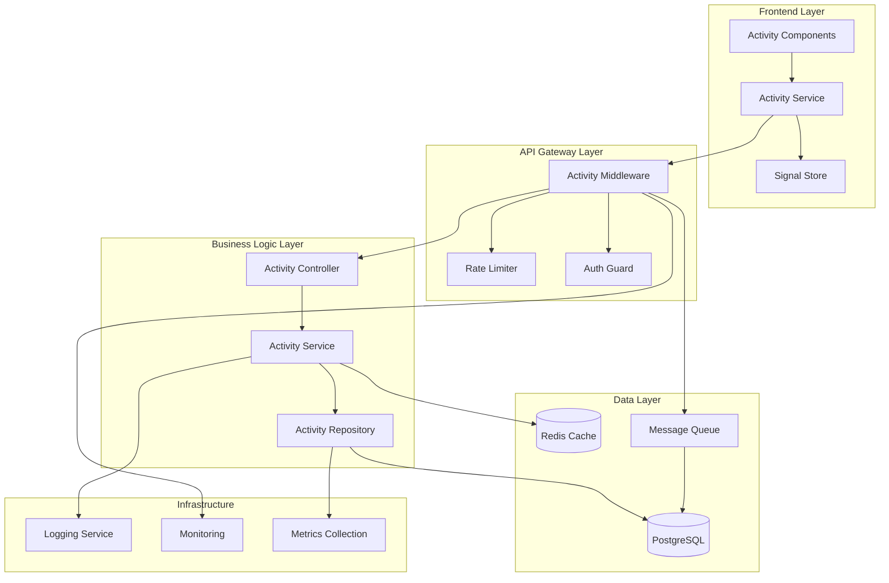
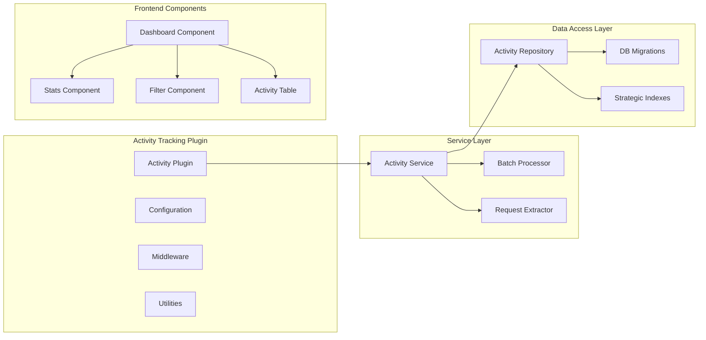
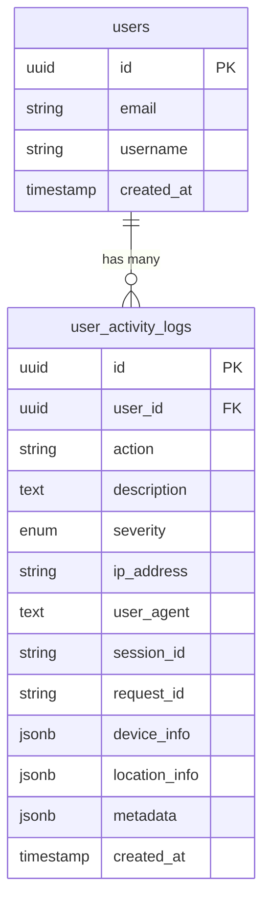
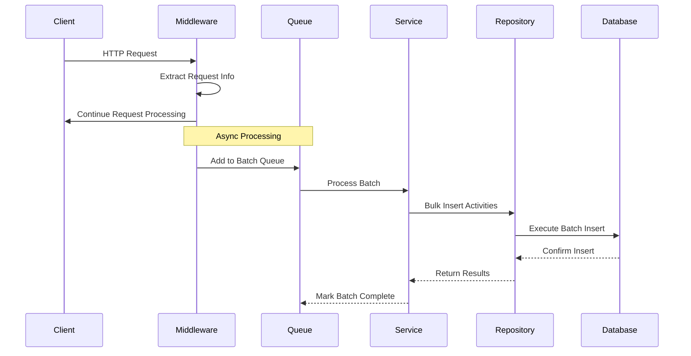
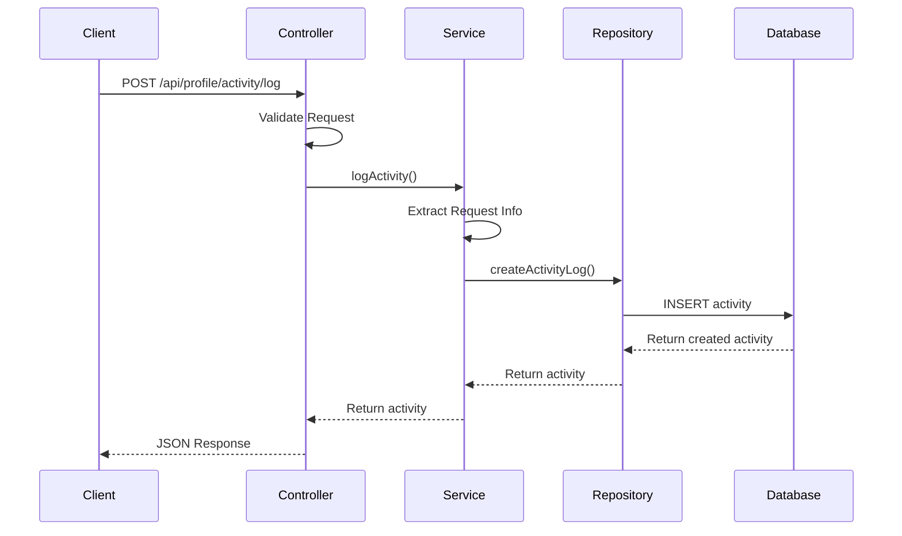
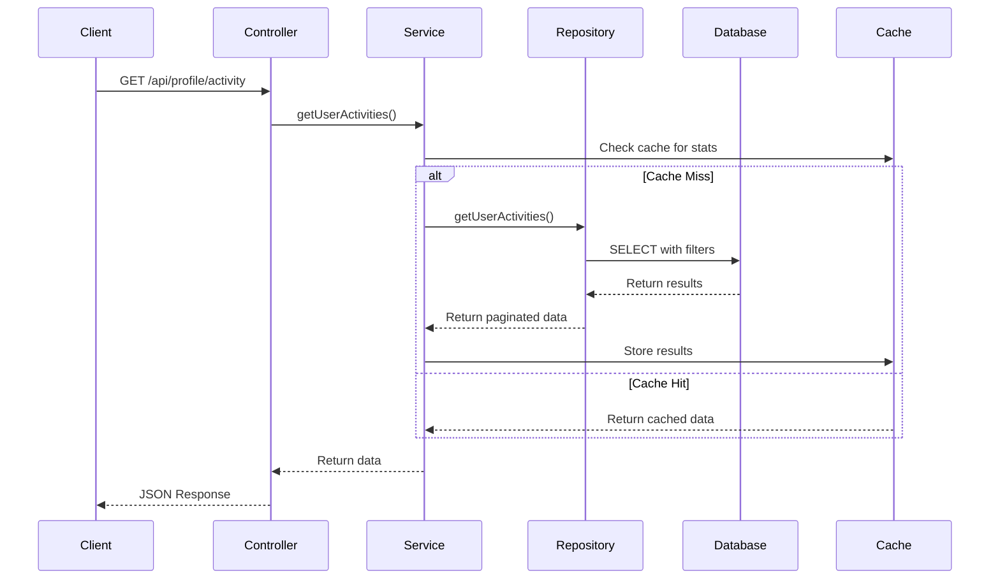

# Activity Tracking System - Architecture Guide

## Overview

This document provides a comprehensive architectural overview of the Activity Tracking System, including design decisions, component interactions, data flow patterns, and scalability considerations. The system is designed for high-volume activity logging with real-time dashboard capabilities.

## System Architecture

### High-Level Architecture



### Component Architecture



## Design Principles

### 1. Performance First

**Asynchronous Processing**
- Activities are logged asynchronously to avoid blocking main request flow
- Batch processing minimizes database connections and improves throughput
- Strategic indexing optimizes query performance

**Memory Efficiency**
- Streaming results for large datasets
- Connection pooling prevents resource exhaustion
- Garbage collection optimization for high-volume scenarios

### 2. Scalability

**Horizontal Scaling**
- Stateless design allows for easy horizontal scaling
- Database partitioning ready for multi-tenant scenarios
- Message queue integration for distributed processing

**Vertical Scaling**
- Optimized database queries with proper indexing
- Efficient memory usage patterns
- Connection pool optimization

### 3. Reliability

**Fault Tolerance**
- Graceful degradation when activity logging fails
- Retry mechanisms with exponential backoff
- Dead letter queue for failed activities

**Data Integrity**
- ACID compliance for critical operations
- Foreign key constraints ensure data consistency
- Automatic cleanup procedures prevent data bloat

### 4. Security

**Privacy by Design**
- Minimal data collection (only necessary information)
- IP address masking options
- Configurable data retention policies

**Access Control**
- User can only access their own activities
- Role-based access for administrators
- API rate limiting prevents abuse

## Data Architecture

### Database Schema Design



### Index Strategy

#### Primary Indexes

```sql
-- Primary key (automatic)
CREATE UNIQUE INDEX idx_user_activity_logs_pkey ON user_activity_logs(id);

-- Most common query pattern
CREATE INDEX idx_user_activity_user_created 
  ON user_activity_logs(user_id, created_at DESC);
```

#### Secondary Indexes

```sql
-- User-specific queries
CREATE INDEX idx_user_activity_user_id ON user_activity_logs(user_id);

-- Action-based filtering
CREATE INDEX idx_user_activity_user_action 
  ON user_activity_logs(user_id, action);

-- Security monitoring
CREATE INDEX idx_user_activity_severity_created 
  ON user_activity_logs(severity, created_at);

-- Session tracking
CREATE INDEX idx_user_activity_session ON user_activity_logs(session_id);

-- IP-based analysis
CREATE INDEX idx_user_activity_ip ON user_activity_logs(ip_address);
```

#### Partial Indexes for Hot Data

```sql
-- Recent activities (most frequently accessed)
CREATE INDEX idx_user_activity_recent 
  ON user_activity_logs(user_id, created_at) 
  WHERE created_at > CURRENT_DATE - INTERVAL '30 days';

-- Critical activities
CREATE INDEX idx_user_activity_critical 
  ON user_activity_logs(user_id, created_at, action) 
  WHERE severity IN ('error', 'critical');
```

### Data Retention Strategy

```sql
-- Automatic cleanup function
CREATE OR REPLACE FUNCTION cleanup_old_activity_logs()
RETURNS void AS $$
BEGIN
  -- Keep only last 2 years of activity logs
  DELETE FROM user_activity_logs 
  WHERE created_at < CURRENT_DATE - INTERVAL '2 years';
  
  -- Log cleanup statistics
  GET DIAGNOSTICS deleted_rows = ROW_COUNT;
  RAISE NOTICE 'Cleaned up % old activity logs', deleted_rows;
END;
$$ LANGUAGE plpgsql;

-- Schedule cleanup (via cron or application scheduler)
SELECT cron.schedule('cleanup-activities', '0 2 * * *', 'SELECT cleanup_old_activity_logs();');
```

## Request Flow Architecture

### Automatic Activity Logging Flow



### Manual Activity Logging Flow



### Activity Query Flow



## Component Design

### Backend Components

#### Activity Logging Plugin

```typescript
// Plugin architecture with dependency injection
@Plugin('activity-logging')
export class ActivityLoggingPlugin {
  constructor(
    private config: ActivityLogPluginConfig,
    private service: UserActivityService,
    private middleware: ActivityMiddleware
  ) {}
  
  async register(fastify: FastifyInstance): Promise<void> {
    // Register hooks
    fastify.addHook('preHandler', this.middleware.preHandler);
    fastify.addHook('onResponse', this.middleware.onResponse);
    fastify.addHook('onError', this.middleware.onError);
    
    // Decorate fastify instance
    fastify.decorate('logActivity', this.service.logActivity.bind(this.service));
    fastify.decorate('activityUtils', ActivityUtils);
  }
}
```

#### Activity Middleware

```typescript
// High-performance middleware with batching
export class ActivityMiddleware {
  private batchQueue: ActivityBatch[] = [];
  private flushTimer?: NodeJS.Timeout;
  private processing = false;
  
  async onResponse(request: FastifyRequest, reply: FastifyReply): Promise<void> {
    if (!this.shouldLog(request, reply)) return;
    
    const activity = this.buildActivity(request, reply);
    
    if (this.config.async) {
      await this.addToBatch(activity);
    } else {
      await this.service.logActivity(activity);
    }
  }
  
  private async addToBatch(activity: ActivityBatch): Promise<void> {
    this.batchQueue.push(activity);
    
    if (this.batchQueue.length >= this.config.batchSize) {
      await this.flushBatch();
    } else if (!this.flushTimer) {
      this.flushTimer = setTimeout(
        () => this.flushBatch(), 
        this.config.flushInterval
      );
    }
  }
}
```

#### Service Layer Architecture

```typescript
// Service layer with clear separation of concerns
export class UserActivityService {
  constructor(
    private repository: UserActivityRepository,
    private requestExtractor: RequestInfoExtractor,
    private batchProcessor: BatchProcessor
  ) {}
  
  // High-level activity logging methods
  async logLogin(userId: string, request: FastifyRequest, success: boolean): Promise<ActivityLog> {
    const action = success ? 'login' : 'login_failed';
    const severity = success ? 'info' : 'warning';
    
    return this.logActivity(userId, action, description, request, { severity });
  }
  
  // Core logging functionality
  async logActivity(
    userId: string,
    action: ActivityAction,
    description: string,
    request?: FastifyRequest,
    options?: ActivityOptions
  ): Promise<ActivityLog> {
    const requestInfo = request ? this.requestExtractor.extract(request) : undefined;
    const activityData = this.buildActivityData(action, description, options);
    
    return this.repository.createActivityLog(userId, activityData, requestInfo);
  }
}
```

### Frontend Components

#### Signal-Based State Management

```typescript
// Modern Angular signals for reactive state management
@Injectable({ providedIn: 'root' })
export class ActivityLogService {
  // Internal signals
  private activitiesSignal = signal<ActivityLog[]>([]);
  private loadingSignal = signal<boolean>(false);
  private errorSignal = signal<string | null>(null);
  private statsSignal = signal<ActivityLogStats | null>(null);
  
  // Public readonly signals
  readonly activities = this.activitiesSignal.asReadonly();
  readonly loading = this.loadingSignal.asReadonly();
  readonly error = this.errorSignal.asReadonly();
  readonly stats = this.statsSignal.asReadonly();
  
  // Computed signals
  readonly hasActivities = computed(() => this.activitiesSignal().length > 0);
  readonly totalActivities = computed(() => this.paginationSignal()?.total ?? 0);
  
  // Signal-based data loading
  loadActivities(filters?: ActivityLogFilters): Observable<ActivityLogResponse> {
    this.loadingSignal.set(true);
    this.errorSignal.set(null);
    
    return this.http.get<ApiResponse<ActivityLogResponse>>(this.baseUrl, { params })
      .pipe(
        tap(response => {
          this.activitiesSignal.set(response.data.activities);
          this.paginationSignal.set(response.data.pagination);
          this.loadingSignal.set(false);
        }),
        catchError(error => {
          this.errorSignal.set(error.message);
          this.loadingSignal.set(false);
          throw error;
        })
      );
  }
}
```

#### Component Architecture

```typescript
// Smart component with dependency injection
@Component({
  selector: 'ax-activity-log',
  standalone: true,
  changeDetection: ChangeDetectionStrategy.OnPush,
  template: `
    <!-- Reactive template with signals -->
    @if (isLoading()) {
      <ax-loading-spinner></ax-loading-spinner>
    } @else if (error()) {
      <ax-error-message [error]="error()"></ax-error-message>
    } @else {
      <ax-activity-table 
        [activities]="activities()"
        [pagination]="pagination()"
        (pageChange)="onPageChange($event)"
      ></ax-activity-table>
    }
  `
})
export class ActivityLogComponent {
  private activityService = inject(ActivityLogService);
  
  // Service signals
  activities = this.activityService.activities;
  pagination = this.activityService.pagination;
  isLoading = this.activityService.loading;
  error = this.activityService.error;
  
  // Computed properties
  hasActivities = computed(() => this.activities().length > 0);
  
  ngOnInit(): void {
    this.activityService.loadActivities().subscribe();
  }
}
```

## Performance Architecture

### Database Performance

#### Query Optimization Strategy

```sql
-- Optimized query for common use case
EXPLAIN ANALYZE
SELECT id, action, description, severity, created_at, device_info
FROM user_activity_logs 
WHERE user_id = $1 
  AND created_at >= $2 
  AND created_at <= $3
ORDER BY created_at DESC 
LIMIT 20 OFFSET 0;

-- Query plan should use index scan on (user_id, created_at)
```

#### Connection Pool Configuration

```typescript
// Optimized connection pool for high-volume scenarios
const dbConfig = {
  client: 'postgresql',
  connection: {
    host: process.env.DB_HOST,
    port: parseInt(process.env.DB_PORT || '5432'),
    user: process.env.DB_USER,
    password: process.env.DB_PASSWORD,
    database: process.env.DB_NAME
  },
  pool: {
    min: 10,           // Minimum connections
    max: 50,           // Maximum connections
    createTimeoutMillis: 3000,
    acquireTimeoutMillis: 30000,
    idleTimeoutMillis: 30000,
    reapIntervalMillis: 1000,
    createRetryIntervalMillis: 100,
    propagateCreateError: false
  },
  acquireConnectionTimeout: 60000
};
```

### Batching Architecture

#### Intelligent Batch Processing

```typescript
class IntelligentBatcher {
  private queues = new Map<string, ActivityBatch[]>();
  private timers = new Map<string, NodeJS.Timeout>();
  
  async addActivity(userId: string, activity: ActivityBatch): Promise<void> {
    const userQueue = this.queues.get(userId) || [];
    userQueue.push(activity);
    this.queues.set(userId, userQueue);
    
    // User-specific batching
    if (userQueue.length >= this.getBatchSize(userId)) {
      await this.flushUserBatch(userId);
    } else {
      this.scheduleFlush(userId);
    }
  }
  
  private getBatchSize(userId: string): number {
    // Dynamic batch size based on user activity frequency
    const userStats = this.getUserStats(userId);
    return userStats.highActivity ? 50 : 10;
  }
  
  private async flushUserBatch(userId: string): Promise<void> {
    const batch = this.queues.get(userId) || [];
    if (batch.length === 0) return;
    
    this.clearTimer(userId);
    this.queues.delete(userId);
    
    try {
      await this.repository.createActivitiesBatch(batch);
      this.metrics.recordSuccessfulBatch(batch.length);
    } catch (error) {
      await this.handleBatchError(batch, error);
    }
  }
}
```

### Caching Strategy

#### Multi-Level Caching

```typescript
class ActivityCacheManager {
  constructor(
    private redisClient: Redis,
    private localCache: NodeCache
  ) {}
  
  async getActivityStats(userId: string): Promise<ActivityStats | null> {
    // L1: Local cache (fastest)
    const localKey = `stats:${userId}`;
    let stats = this.localCache.get<ActivityStats>(localKey);
    if (stats) return stats;
    
    // L2: Redis cache (fast)
    const redisKey = `activity:stats:${userId}`;
    const cached = await this.redisClient.get(redisKey);
    if (cached) {
      stats = JSON.parse(cached);
      this.localCache.set(localKey, stats, 300); // 5 minutes local cache
      return stats;
    }
    
    // L3: Database (slowest, but authoritative)
    return null;
  }
  
  async setActivityStats(userId: string, stats: ActivityStats): Promise<void> {
    const localKey = `stats:${userId}`;
    const redisKey = `activity:stats:${userId}`;
    
    // Set in both caches
    this.localCache.set(localKey, stats, 300); // 5 minutes
    await this.redisClient.setex(redisKey, 1800, JSON.stringify(stats)); // 30 minutes
  }
}
```

## Scalability Architecture

### Horizontal Scaling

#### Stateless Design

```typescript
// Stateless service design for horizontal scaling
@Injectable()
export class ActivityService {
  constructor(
    private repository: ActivityRepository,
    private cache: CacheManager,
    private queue: MessageQueue
  ) {}
  
  // No instance state - all operations are stateless
  async logActivity(data: ActivityData): Promise<void> {
    const enrichedData = await this.enrichActivityData(data);
    
    if (this.isHighPriority(enrichedData)) {
      // Immediate processing for critical activities
      await this.repository.create(enrichedData);
    } else {
      // Queue for batch processing
      await this.queue.add('activity-batch', enrichedData);
    }
  }
}
```

#### Load Balancer Configuration

```nginx
# Nginx configuration for activity tracking API
upstream activity_api {
    least_conn;
    server app1:3333 weight=1 max_fails=3 fail_timeout=30s;
    server app2:3333 weight=1 max_fails=3 fail_timeout=30s;
    server app3:3333 weight=1 max_fails=3 fail_timeout=30s;
}

location /api/profile/activity {
    proxy_pass http://activity_api;
    proxy_set_header X-Real-IP $remote_addr;
    proxy_set_header X-Forwarded-For $proxy_add_x_forwarded_for;
    proxy_connect_timeout 5s;
    proxy_read_timeout 10s;
}
```

### Database Scaling

#### Read Replicas

```typescript
// Master-slave configuration for read scaling
class DatabaseManager {
  constructor(
    private masterDb: Knex,
    private readReplicas: Knex[]
  ) {}
  
  // Write operations go to master
  async createActivity(data: ActivityData): Promise<ActivityLog> {
    return this.masterDb('user_activity_logs').insert(data).returning('*');
  }
  
  // Read operations use read replicas
  async getUserActivities(userId: string, query: ActivityQuery): Promise<ActivityLog[]> {
    const replica = this.getRandomReplica();
    return replica('user_activity_logs')
      .where('user_id', userId)
      .orderBy('created_at', 'desc');
  }
  
  private getRandomReplica(): Knex {
    return this.readReplicas[Math.floor(Math.random() * this.readReplicas.length)];
  }
}
```

#### Partitioning Strategy

```sql
-- Time-based partitioning for large datasets
CREATE TABLE user_activity_logs (
    id UUID DEFAULT gen_random_uuid(),
    user_id UUID NOT NULL,
    action VARCHAR(100) NOT NULL,
    created_at TIMESTAMP NOT NULL DEFAULT NOW(),
    -- ... other columns
) PARTITION BY RANGE (created_at);

-- Create monthly partitions
CREATE TABLE user_activity_logs_2024_01 
PARTITION OF user_activity_logs 
FOR VALUES FROM ('2024-01-01') TO ('2024-02-01');

CREATE TABLE user_activity_logs_2024_02 
PARTITION OF user_activity_logs 
FOR VALUES FROM ('2024-02-01') TO ('2024-03-01');

-- Automatic partition management
CREATE OR REPLACE FUNCTION create_monthly_partition()
RETURNS void AS $$
DECLARE
    start_date DATE := DATE_TRUNC('month', CURRENT_DATE + INTERVAL '1 month');
    end_date DATE := start_date + INTERVAL '1 month';
    table_name TEXT := 'user_activity_logs_' || TO_CHAR(start_date, 'YYYY_MM');
BEGIN
    EXECUTE format('CREATE TABLE IF NOT EXISTS %I PARTITION OF user_activity_logs FOR VALUES FROM (%L) TO (%L)', 
                   table_name, start_date, end_date);
END;
$$ LANGUAGE plpgsql;
```

## Security Architecture

### Data Privacy

#### PII Protection

```typescript
class DataPrivacyManager {
  private sensitiveFields = ['ip_address', 'user_agent', 'location_info'];
  
  async maskSensitiveData(activity: ActivityLog): Promise<ActivityLog> {
    const masked = { ...activity };
    
    // IP address masking
    if (masked.ip_address) {
      masked.ip_address = this.maskIpAddress(masked.ip_address);
    }
    
    // User agent truncation
    if (masked.user_agent) {
      masked.user_agent = this.truncateUserAgent(masked.user_agent);
    }
    
    // Location generalization
    if (masked.location_info) {
      masked.location_info = this.generalizeLocation(masked.location_info);
    }
    
    return masked;
  }
  
  private maskIpAddress(ip: string): string {
    // Keep first two octets for IPv4
    const parts = ip.split('.');
    if (parts.length === 4) {
      return `${parts[0]}.${parts[1]}.xxx.xxx`;
    }
    return 'xxx.xxx.xxx.xxx';
  }
}
```

#### Access Control

```typescript
// Role-based access control for activities
class ActivityAccessControl {
  canViewActivities(viewer: User, targetUserId: string): boolean {
    // Users can view their own activities
    if (viewer.id === targetUserId) return true;
    
    // Admins can view any user's activities
    if (viewer.role === 'admin') return true;
    
    // Support staff with proper permissions
    if (viewer.role === 'support' && viewer.permissions.includes('view_user_activities')) {
      return true;
    }
    
    return false;
  }
  
  filterActivityFields(activity: ActivityLog, viewer: User): Partial<ActivityLog> {
    const allowedFields = this.getAllowedFields(viewer.role);
    return pick(activity, allowedFields);
  }
  
  private getAllowedFields(role: string): string[] {
    const fieldMap = {
      user: ['id', 'action', 'description', 'severity', 'created_at'],
      support: ['id', 'action', 'description', 'severity', 'created_at', 'session_id'],
      admin: ['*'] // All fields
    };
    
    return fieldMap[role] || fieldMap.user;
  }
}
```

### API Security

#### Rate Limiting Architecture

```typescript
// Advanced rate limiting with sliding window
class SlidingWindowRateLimit {
  constructor(
    private redis: Redis,
    private windowSizeMs: number,
    private maxRequests: number
  ) {}
  
  async isAllowed(userId: string, endpoint: string): Promise<boolean> {
    const key = `rate_limit:${userId}:${endpoint}`;
    const now = Date.now();
    const windowStart = now - this.windowSizeMs;
    
    // Remove expired entries
    await this.redis.zremrangebyscore(key, 0, windowStart);
    
    // Count current requests
    const currentCount = await this.redis.zcard(key);
    
    if (currentCount >= this.maxRequests) {
      return false;
    }
    
    // Add current request
    await this.redis.zadd(key, now, `${now}-${Math.random()}`);
    await this.redis.expire(key, Math.ceil(this.windowSizeMs / 1000));
    
    return true;
  }
}
```

## Monitoring Architecture

### Application Monitoring

#### Custom Metrics Collection

```typescript
class ActivityMetricsCollector {
  private metrics = {
    activitiesLogged: new Counter('activities_logged_total'),
    batchProcessingTime: new Histogram('batch_processing_duration_ms'),
    databaseConnections: new Gauge('database_connections_active'),
    queueSize: new Gauge('activity_queue_size')
  };
  
  recordActivityLogged(userId: string, action: string): void {
    this.metrics.activitiesLogged
      .labels({ user_id: userId, action })
      .inc();
  }
  
  recordBatchProcessed(batchSize: number, durationMs: number): void {
    this.metrics.batchProcessingTime
      .labels({ batch_size: batchSize.toString() })
      .observe(durationMs);
  }
  
  updateQueueSize(size: number): void {
    this.metrics.queueSize.set(size);
  }
}
```

#### Health Check Architecture

```typescript
// Comprehensive health checking
@Controller('/health')
export class ActivityHealthController {
  constructor(
    private repository: ActivityRepository,
    private cache: CacheManager,
    private queue: MessageQueue
  ) {}
  
  @Get('/activity-tracking')
  async checkHealth(): Promise<HealthCheckResult> {
    const checks = await Promise.allSettled([
      this.checkDatabase(),
      this.checkCache(),
      this.checkQueue(),
      this.checkRecentActivity()
    ]);
    
    const results = checks.map((check, index) => ({
      name: ['database', 'cache', 'queue', 'recent_activity'][index],
      status: check.status === 'fulfilled' ? 'healthy' : 'unhealthy',
      details: check.status === 'fulfilled' ? check.value : check.reason
    }));
    
    const overallStatus = results.every(r => r.status === 'healthy') 
      ? 'healthy' 
      : 'unhealthy';
    
    return {
      service: 'activity-tracking',
      status: overallStatus,
      timestamp: new Date().toISOString(),
      checks: results
    };
  }
}
```

## Disaster Recovery Architecture

### Backup Strategy

#### Automated Database Backups

```sql
-- Point-in-time recovery setup
-- Enable WAL archiving
ALTER SYSTEM SET archive_mode = 'on';
ALTER SYSTEM SET archive_command = 'cp %p /backup/wal/%f';
ALTER SYSTEM SET max_wal_senders = 3;
ALTER SYSTEM SET wal_level = 'replica';

-- Automated backup script
#!/bin/bash
BACKUP_DIR="/backup/activity_tracking"
DATE=$(date +%Y%m%d_%H%M%S)
DB_NAME="aegisx_production"

# Create base backup
pg_basebackup -D "$BACKUP_DIR/base_$DATE" -Ft -z -P

# Backup activity logs table specifically
pg_dump -t user_activity_logs "$DB_NAME" | gzip > "$BACKUP_DIR/activity_logs_$DATE.sql.gz"

# Cleanup old backups (keep 30 days)
find "$BACKUP_DIR" -type f -mtime +30 -delete
```

### Failover Architecture

#### Database Failover

```typescript
// Automatic failover configuration
class DatabaseFailoverManager {
  private primaryDb: Knex;
  private standbyDb: Knex;
  private currentDb: Knex;
  private healthCheckInterval = 5000; // 5 seconds
  
  constructor(primaryConfig: any, standbyConfig: any) {
    this.primaryDb = knex(primaryConfig);
    this.standbyDb = knex(standbyConfig);
    this.currentDb = this.primaryDb;
    
    this.startHealthMonitoring();
  }
  
  private async startHealthMonitoring(): void {
    setInterval(async () => {
      try {
        await this.primaryDb.raw('SELECT 1');
        
        // Primary is healthy, switch back if needed
        if (this.currentDb !== this.primaryDb) {
          console.log('Primary database is back online, switching back');
          this.currentDb = this.primaryDb;
        }
      } catch (error) {
        // Primary is down, switch to standby
        if (this.currentDb === this.primaryDb) {
          console.log('Primary database is down, switching to standby');
          this.currentDb = this.standbyDb;
        }
      }
    }, this.healthCheckInterval);
  }
  
  getCurrentDb(): Knex {
    return this.currentDb;
  }
}
```

---

This architecture guide provides a comprehensive overview of the Activity Tracking System's design, from high-level system architecture to detailed implementation patterns. The system is designed to handle high-volume activity logging while maintaining performance, scalability, and reliability.